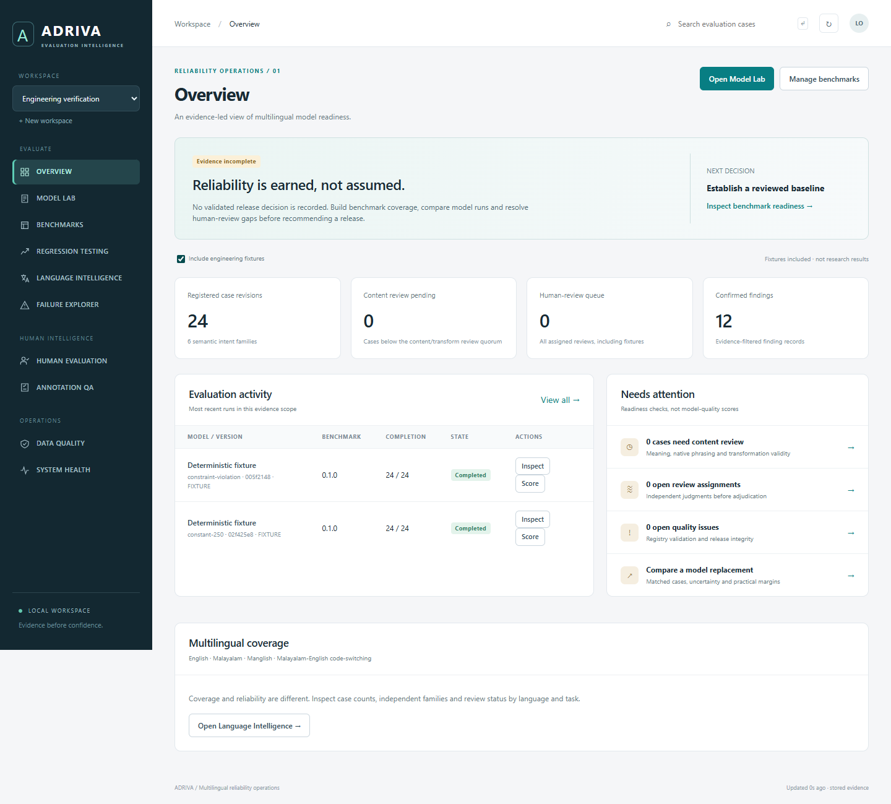

# ADRIVA — Multilingual Evaluation Intelligence

A working local AI-evaluation workbench: versioned benchmarks, durable evaluation jobs, deterministic scoring, paired comparisons, blind human review, annotation QA and failure investigation.

**Verified scope:** Windows local deployment with FastAPI, PostgreSQL and a responsive browser interface. **Not a production SaaS or a validated model leaderboard.** No real-model performance or genuine human-rating results are supplied.



## Open on this computer

From PowerShell:

```powershell
cd C:\Users\adria\Documents\Codex\2026-10-01\new-chat-9\ADRIVA
.\Start-ADRIVA.ps1
```

Open **http://127.0.0.1:8019**. API documentation: **http://127.0.0.1:8019/docs**.

The launcher uses this project's own PostgreSQL data directory at `.local/pgdata`, port **55439**, and the existing PostgreSQL installation at `D:\Postgre\bin`. It checks the data directory before using an existing listener. For a different PostgreSQL installation, pass `-PostgresBin 'C:\Program Files\PostgreSQL\18\bin'`.

This isolated cluster uses loopback trust authentication for a single trusted local OS user. Do not expose it to a network or use it for sensitive production data. Credentials, data and logs are excluded from the source package.

## First five minutes

1. Select **Engineering verification**. Enable **Include engineering fixtures** to inspect explicitly labeled test runs.
2. Open **Model Lab → Inspect** for stored responses and scoring coverage.
3. Open **Regression Testing**, choose the two fixture runs and **Reference exact match**. The result correctly stays **HOLD**; fixtures are not scientific evidence.
4. Open **Language Intelligence** and select a language/task cell to inspect its cases. Use **Failure Explorer** to inspect confirmed format/length violations.
5. Select **ADRIVA research workspace**. Its 24 draft cases are synthetic and unreviewed. Data Quality lists the review work needed; publishing is blocked until two distinct content reviewers, and two transformation reviewers for derived cases, submit verification without unresolved negative reviews.

No review or model-quality result is invented during onboarding. An empty human-review queue is expected until you create a study from two completed runs.

## Install on another Windows computer

Requires Python 3.12 or 3.13 and PostgreSQL binaries. Install inside this directory:

```powershell
py -3.12 -m venv .venv
.\.venv\Scripts\python.exe -m pip install -r backend\requirements.lock.txt
.\.venv\Scripts\python.exe -m pip install --no-deps --no-build-isolation -e backend
.\Start-ADRIVA.ps1 -PostgresBin 'C:\Program Files\PostgreSQL\18\bin'
```

Package-index installation on a second computer and Docker deployment were not executed here. The verified environment was created using existing local dependencies; `pip check` passes. A source ZIP does not contain the virtual environment, PostgreSQL binaries or a pretrained model.

For Linux or a manually administered PostgreSQL database, install `libpq`, install the backend, set `ADRIVA_DATABASE_URL`, run `adriva migrate`, and start `uvicorn adriva.api.app:app --host 127.0.0.1 --port 8019` and `python -m adriva.workers.runner --watch` in separate terminals. This path is documented but unverified here.

## Execute tests here

Only use a disposable database whose name ends in `_test`. Tests truncate its application tables.

```powershell
$env:ADRIVA_LIBPQ_DIR='D:\Postgre\bin'
$env:ADRIVA_TEST_DATABASE_URL='postgresql://adriva@127.0.0.1:55439/adriva_test'
.\.venv\Scripts\python.exe tools\run_local.py pytest backend\tests -q
.\.venv\Scripts\ruff.exe check --config backend\pyproject.toml backend tools
.\.venv\Scripts\ruff.exe format --check --config backend\pyproject.toml backend tools
```

On a new installation, create `adriva_test` first with PostgreSQL's `createdb`. Browser checks use `tools/browser_smoke.cjs`, Playwright, and Edge; set `PLAYWRIGHT_MODULE` to the installed package path if it is not in normal Node resolution. See `docs/VERIFICATION.md` for the recorded commands and results.

## Connect a real model

Use a model service you control or have permission and budget to call. The adapter supports a chat-completions-compatible JSON API; this is protocol support, not a claim that every provider is compatible.

1. Set `ADRIVA_ENDPOINT_LOCAL` in the worker's environment to the full chat-completions URL. Use HTTPS, or HTTP only for localhost.
2. If required, set `ADRIVA_PROVIDER_KEY_LOCAL` locally. Never paste the key into the model registration form, repository or chat.
3. Restart the worker so it receives the new environment. Register the model's actual identifier and version, `openai_compatible`, endpoint **reference name**, optional credential **reference name**, and supported parameters.
4. Complete genuine benchmark reviews and freeze a release before launching a scientific run. Alternatively use a fixture benchmark for a protocol check; the run remains fixture-class evidence.
5. Launch, wait for a terminal state, score, inspect responses and compare matched runs.

Provider calls can incur fees. No paid or real-model calls were made in this delivery. Missing providers, network errors, HTTP 429s and malformed results remain failures with explicit status; no success values are fabricated.

## Product modules

Overview · Model Lab · Benchmarks · Regression Testing · Language Intelligence · Failure Explorer · Human Evaluation · Annotation QA · Data Quality · System Health.

The UI includes project selection, search, task/language/version filters, comparison plots, case/run inspection, import/export, immutable model registration, run creation/cancellation/scoring, blind rating forms, content-review forms, worker heartbeats and stale-snapshot notices.

## Evidence discipline

- Benchmark origin, intended use and transformation lineage are separate fields. Human review never erases synthetic origin.
- Frozen release manifests and source-code scorer digests preserve comparison identity.
- Correlated language variants are grouped into intent families and dependency clusters. Four translations are not four independent observations.
- Exact match, literals and format checks cannot certify semantic fidelity or Malayalam naturalness.
- Incomplete pairs, small cluster counts, degenerate intervals and pilot/fixture evidence force HOLD.
- Human identity is self-attested locally; there is no production SSO/RBAC. Production startup is deliberately refused.

## Documentation

- `docs/FINAL-DELIVERY.md`: full delivery report and truthful CV/interview language.
- `docs/VERIFICATION.md`: checks actually executed and evidence files.
- `docs/AUDIT.md`: security, scientific and recruiter audit with unresolved scope limits.
- `docs/BENCHMARK-CARD.md`: composition, provenance and restrictions.
- `docs/science/01-protocol.md`: methodology and statistical assumptions.
- `docs/architecture/`: inherited architecture documents; designs are not completion evidence.

## Structure

```text
backend/src/adriva/
  api/          FastAPI product, registry and review endpoints
  db/           connections, checksummed migrations, SQL views and guards
  domain/       benchmark contracts, versioning and run creation
  evaluation/   deterministic scoring, statistics, agreement and audit kernels
  gateway/      offline fixture and compatible HTTP adapters
  workers/      leased, recoverable evaluation execution
  storage/      content-addressed response artifacts
  web/          responsive HTML/CSS/JavaScript application
backend/tests/  unit, PostgreSQL and local HTTP transport tests
benchmarks/     separate engineering fixtures and draft pilot seed pack
tools/          launch, bootstrap, benchmark build and browser verification
docs/           delivery, methodology, audit and screenshots
infra/          optional container scaffolding (not verified here)
```

This project demonstrates evaluation engineering and evidence handling. It does not prove model superiority, enterprise deployment, broad Malayalam competence or a production service-level objective.
