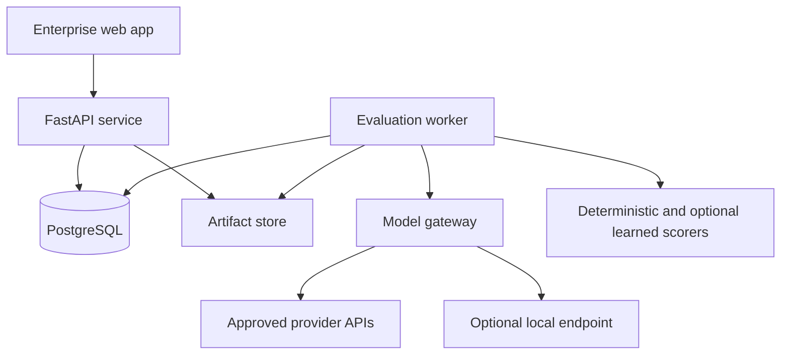

# ADRIVA: product and system architecture

Design baseline 1.0 • 1 October 2026 • Normative design, not a claim of completed functionality.

## 1. Final product definition

**ADRIVA — Multilingual AI Reliability, Evaluation & Human Intelligence Platform** is an internal application for evaluation engineers, bilingual reviewers and model-release owners. It compares immutable model configurations on versioned benchmark releases, measures task performance and sensitivity to controlled language changes, collects blind human judgments and explains release risks using inspectable evidence.

The decision ADRIVA supports is: “For this benchmark, task mix, languages, generation configuration and evaluation protocol, does candidate V2 meet our declared release criteria relative to V1?” It must show the scope and uncertainty of that answer. It cannot establish that a model is reliable for all Malayalam speakers or every deployment context.

The distinctive product is a **semantic-intent family**: a verified task expressed in multiple languages, registers, scripts and perturbations. ADRIVA measures preservation of required behavior, not exact matching of the model's words. A second distinctive element is the evidence chain from a release warning to the original prompt, response, scorer, human judgment and benchmark revision.

The product is a workbench, not the deployed assistant under evaluation. “Human Intelligence” refers to reviewer expertise, adjudication and failure analysis; it is not another model metric.

### First credible release

- Four required input modes: English, Malayalam, Romanized Malayalam/Manglish and Malayalam-English code-switching.
- Three primary task tracks: grounded QA, schema-constrained extraction and translation. Instruction constraints are also tagged across tracks.
- Summarization and bounded reasoning follow after scoring and reviewer workflows are stable.
- Small, human-verified pilot plus explicitly marked fixtures; no large synthetic benchmark disguised as validated coverage.
- Two model configurations, a deterministic offline fixture adapter, and one real provider adapter initially.
- One organization with project-scoped access. A local demo is the first milestone, not a SaaS launch.

## 2. User personas

| Persona | Decisions and work | Permissions |
|---|---|---|
| Evaluation engineer | Define task contracts, freeze runs, inspect scoring errors | Manage benchmarks and runs within assigned projects |
| Malayalam/English language reviewer | Check semantic equivalence, fluency and cultural context | Assigned source review and blind annotation only |
| Annotation lead | Calibrate reviewers, inspect disagreement, adjudicate | Assignment administration and QA; restricted access to identities |
| Model-release owner | Compare V1/V2, set margins before testing, accept or block a release | Read evidence, authorize comparison protocols and record decisions |
| Data-quality analyst | Find duplicates, lineage defects, invalid gold answers | Review/quarantine data; cannot silently rewrite releases |
| Platform administrator | Configure provider endpoints, roles and operational policies | Infrastructure and access administration; audited privileged access |
| Portfolio reviewer | Inspect methodology and reproduce a safe demo | Read-only sanitized project; no provider keys or private benchmark access |

The same person may hold several roles locally. Role overlap must not be represented as independent annotation.

## 3. Primary workflows

1. **Create benchmark:** import draft items → validate schema/license/provenance → group shared intents and sources → author expected behavior → verify meaning and reference answers → assign family-level split → freeze manifest and digest. Publication is blocked on unresolved critical quality findings.
2. **Compare models:** select the same release and case revisions → freeze generation and scoring configuration → declare estimands/margins → estimate and cap spend → enqueue balanced/interleaved model requests → retain every attempt → score → check completeness → produce paired evidence.
3. **Test robustness:** choose reviewed baseline and one controlled change → confirm invariant or expected directional change → generate responses under the same protocol → score behavior → aggregate within families → investigate language/perturbation-specific drops.
4. **Collect human evidence:** select probability-based evaluation sample → randomize A/B assignments server-side → independent scoring → lock submissions → compute pre-adjudication agreement → resolve selected disagreements → preserve both original and adjudicated records.
5. **Investigate failure:** open slice → inspect source and response → see automatic finding as unconfirmed or confirmed → attach evidence spans → classify severity → determine model defect versus benchmark/scorer defect → propose a new challenge case for a future release.
6. **Review regression:** compare matched outputs and task gates → show improvements, regressions, equivalence and inconclusive results → identify pass-to-fail cases → review critical failures → record RELEASE/BLOCK/HOLD decision with reasons. ADRIVA never automatically replaces a deployed model.

## 4. Product requirements

| ID | Requirement | Observable acceptance |
|---|---|---|
| R01 | Versioned benchmark and provenance | Any run resolves exact case, source, rubric and manifest digests |
| R02 | Controlled multilingual variants | Each scored variant identifies its parent, operator, invariant and review status |
| R03 | Typed model execution | Raw and normalized requests/responses, errors, time, usage and provider identity retained |
| R04 | Task-aware evaluation | Every score specifies metric version, applicability, evidence and denominator |
| R05 | Blind human comparison | Annotator APIs do not return model IDs, scores or other reviewers' ratings |
| R06 | Annotation QA | Independent overlap, disagreement review and unmodified original ratings supported |
| R07 | Paired inference | Related variants share a resampling cluster; missing pairs remain visible |
| R08 | Regression gates | Comparison refuses incompatible protocol hashes; no p-value-only “same” claim |
| R09 | Failure investigation | A finding links response, taxonomy revision, evidence, author and verification state |
| R10 | Operational resilience | Interrupted work resumes without duplicate logical outputs; attempts remain auditable |
| R11 | Security and privacy | Project access checks, safe exports, secrets isolation and held-out restrictions tested |
| R12 | Reproducible reports | Export includes counts, exclusions, raw estimates, uncertainty, methods and limitations |

Nonfunctional planning envelope: up to 10,000 benchmark cases and 100,000 stored responses on the initial deployment; modest concurrent reviewer usage. These are test targets, not measured capacity. Proposed local database API p95 under 500 ms for paginated reads, excluding generation/scoring; validate with declared hardware and data sizes before claiming this. Use pagination, bounded jobs and cancellation before adding distributed infrastructure.

Accessibility requirements: keyboard operation, visible focus, sufficient contrast, Malayalam-capable fonts, no color-only statuses, clear original/normalized text display, and usable side-by-side review on a laptop screen. Operational targets and retention are configurable and must be published with the environment's limitations.

## 5. System architecture

One backend codebase serves API and worker processes. Domain modules separate benchmarks, execution, evaluation, annotation and reporting. PostgreSQL is the system of record and initial durable queue. ArtifactStore abstracts a local directory first and object storage later. No model request runs inside a database transaction or web request lifecycle.

Run scheduling freezes a manifest and allocates logical response slots before execution. Workers claim short leases, call providers outside transactions, then commit outcomes using lease tokens. Analysis reads an immutable snapshot of completed records. Cancellation stops future work; already completed external calls may still incur cost and must be recorded.

The trust boundary is server-side. The browser never receives provider credentials or hidden A/B mapping. Providers see only approved task payloads. Evaluated text is untrusted content, including when passed into a judge.

## 6. Technology architecture and decision record

All rows are ADRIVA choices; they are not findings that these options outperform alternatives universally.

| ID | DECISION | ALTERNATIVES | WHY SELECTED | TRADE-OFFS |
|---|---|---|---|---|
| A01 | Modular monolith, separate API/worker processes | Microservices; single blocking web process | Clear ownership with manageable local operation | Shared release cycle; future splitting requires stable module interfaces |
| A02 | FastAPI, Pydantic, SQLAlchemy, Alembic | Django; Flask; full TypeScript backend | Python evaluation ecosystem, typed contracts, explicit migrations | More auth/admin assembly than Django |
| A03 | React + TypeScript + Vite SPA | Next.js; Streamlit; Dash | Dense annotation workflows and typed API contracts; no SEO need | Requires frontend engineering; no built-in server rendering |
| A04 | PostgreSQL as source of truth | SQLite; document database | Transactions, relational integrity and serious analytical SQL | Local service and migrations required |
| A05 | PostgreSQL leased jobs initially | Redis/Celery; managed queue | Avoid another service at small scale; durable state near run records | Must implement lease/retry semantics carefully; revisit if polling/locking becomes a measured bottleneck [S07] |
| A06 | Local content-addressed artifacts behind interface | S3 immediately; database blobs | Simple demo and cheap reproducibility | Files and DB need coordinated backup; no high availability |
| A07 | Thin provider adapter interface | Agent framework; gateway framework immediately | Explicit capabilities, minimal implicit behavior | A small amount of adapter code per provider |
| A08 | Native run tracking in PostgreSQL | MLflow; hosted experiment platform | Runs must join annotation and benchmark evidence | Build a small purpose-specific run UI; no broad training lifecycle |
| A09 | Typed relational columns plus bounded JSONB | Everything JSON; one wide table per task | Enforced identity and flexible task payloads | JSON schemas must be versioned; SQL is less simple for arbitrary payloads |
| A10 | Deterministic metrics first; humans for semantic judgments | Universal judge score; embeddings as truth | Testable and interpretable evidence | Human work limits scale; some results stay unknown |
| A11 | Family/source-cluster inference | Treat all variants as independent | Protect confidence estimates from duplicate semantic content | Effective sample size is smaller; wider honest intervals |
| A12 | Frozen benchmark releases and separate calibration split | Continuously edited live benchmark | Prevent moving-target comparisons and leakage | Corrections require new releases and reruns |
| A13 | Dimension-specific results and explicit release gates | Universal weighted “reliability score” | No arbitrary mixing of language quality, factuality and availability | More evidence for release owners to interpret |
| A14 | Single organization, project roles initially | Multi-tenant SaaS; unrestricted demo users | Sufficient portfolio scope without tenant isolation claims | Multi-tenancy requires a separate security design |
| A15 | Logs, health, metrics first; tracing as needed | Full observability platform immediately | Debug actual failure modes without large stack | Cross-service tracing limited until deployment needs it |
| A16 | Portable Compose deployment | Kubernetes; serverless orchestration | Reproducible dev and small hosted evaluation service | One-host failure domain; no automatic HA |

External foundations: PostgreSQL documents queue-style use of SKIP LOCKED [S07]; FastAPI documents independent deployment concerns [S10]. Neither source establishes ADRIVA's proposed performance or reliability; those need testing.

## 7–8. PostgreSQL/data architecture and ER model

The full design is in 03-data-architecture.md. A benchmark release references immutable case revisions. Runs reference releases and immutable model configurations. Responses reference run items and generation attempts. Scoring executions and human studies reference responses, rather than writing one mutable score into a response row. Comparisons reference analysis protocols and evidence snapshots. This structure lets ADRIVA distinguish model changes, benchmark changes and evaluator changes.

For a production-style portfolio, the strongest engineering demonstration is a trustworthy evidence path, database integrity and documented failure recovery—not the number of services in the diagram.
