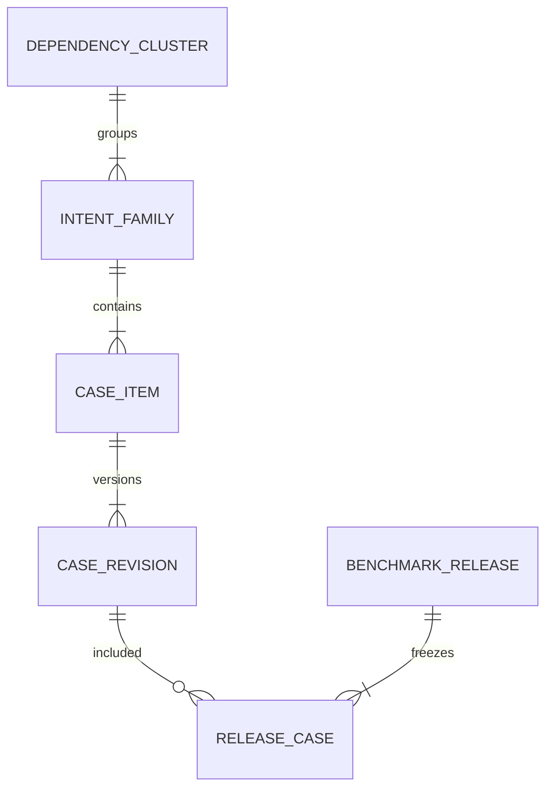
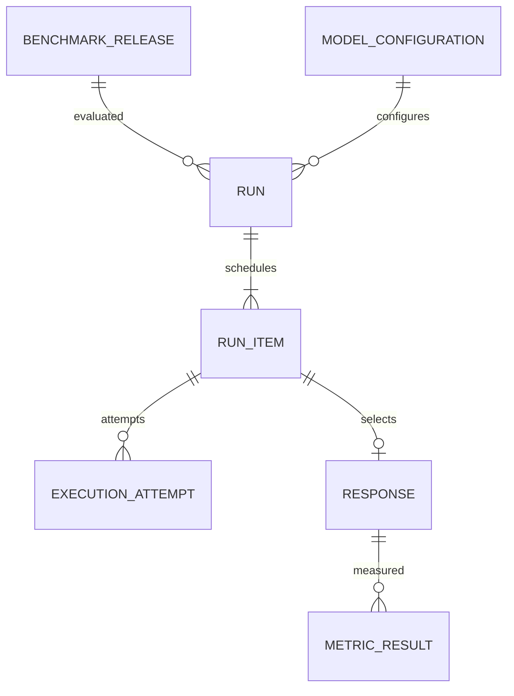
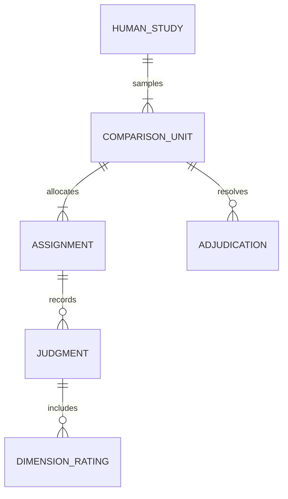

# ADRIVA: PostgreSQL and data model

Logical schema specification; no migrations or application code have been created.

## 7. Data architecture conventions

PostgreSQL is authoritative for identity, lineage, states and scores. UUID primary keys; timestamptz in UTC; numeric for money and exact values; text for original multilingual content; JSONB for validated task payloads and provider metadata. Use explicit text/check constraints or reference tables for evolving taxonomies. Secrets are references to server configuration, never database plaintext values.

All project-owned entities carry project_id directly, with project-consistent composite foreign keys where appropriate. Authorization checks are mandatory at API and service boundaries. One organization is the initial deployment model. Project isolation is not a claim of secure multi-tenancy. Use a non-owner application database role, a separate migration role and restricted annotation queries/views.

Normalized relations handle joins, uniqueness and permissions. JSONB does not replace foreign keys. Draft revisions can change before publication; frozen content, model configurations, scoring definitions and submitted judgments are append-only. Runtime lifecycle rows may update state using compare-and-swap/lease predicates. Audit events capture actor, action, entity and timestamp without duplicating private payloads unnecessarily.

## 8. Entity model

All tables below have an id unless a composite key is specified. Common project_id/created_at fields omitted for readability. Build each group only when its phase starts.

### Identity and benchmark entities — P1/P2

| Entity | Main fields and foreign keys | Key invariants |
|---|---|---|
| project | name, slug, settings_revision | Unique slug; settings changes audited |
| user_account | external_subject or local identity, display_name, state | Never store provider credentials; deactivate without destroying ratings |
| membership | user_id, project_id, role | Unique user/project/role; roles explicit |
| source_record | source_kind, URI, external_revision, item_key, license, permission_note, sensitivity, artifact_id | URI alone is not immutable evidence; rights state required |
| dependency_cluster | project_id, reason | Highest known independent sampling group |
| intent_family | dependency_cluster_id, primary_task, description | All variants share family; connected source families share cluster |
| case_item | family_id, stable_key | Stable identity across revisions |
| case_revision | case_item_id, revision_no, parent_revision_id, input_profile, output_profile, prompt, context, task_payload, expected_contract, usage_class, creation_origin, digest | Unique item/revision; immutable once frozen; bounded validated JSON |
| case_source | case_revision_id, source_id, role | Multi-source lineage, e.g. context versus reference |
| derivation_event | child_revision_id, parent_revision_id, operator_revision, parameters, intended_relation, invariant, generator_config_id nullable | Acyclic lineage; transformed status does not replace origin |
| case_review | case_revision_id, reviewer_id, rubric_revision_id, review_kind, verdict, rationale, submitted_at | Real review event; verification cannot be a free-text provenance badge |
| benchmark | name, purpose, owner_id | Container for releases |
| benchmark_release | benchmark_id, version, state, manifest_digest, schema_version, taxonomy_version, published_at | Unique benchmark/version; publish atomic and manifest immutable |
| release_case | release_id, case_revision_id, split, weight, ordinal | Unique release/case revision; nonnegative weight; cluster never spans splits |

Cases require exactly one primary task, but task capability tags are many-to-many (`case_capability`). Language profiles use typed JSON initially with indexed/generated dimensions only for frequent filters. A `rubric_revision` defines versioned dimensions and anchors; P2 uses it for source review and later phases for response evaluation.

### Execution and scoring — P3/P4

| Entity | Main fields and foreign keys | Key invariants |
|---|---|---|
| model_configuration | provider, endpoint_ref, requested_model, parameters, capability_snapshot, digest | Immutable; credential reference only; no secret in digest |
| run | release_id, model_config_id, generation_protocol_digest, state, manifest_artifact_id, usage_class | Frozen target case list and config before execution |
| run_item | run_id, case_revision_id, repetition_index, request_digest, state | Unique run/case/repetition; case must belong to pinned release |
| execution_attempt | run_item_id, attempt_no, request_id, lease_token, started/finished, provider_request_id, outcome, error_class, returned_model, usage, estimated_cost, cost_basis | Every external attempt retained; usage may be unknown |
| response | run_item_id, attempt_id, raw_artifact_id, normalized_text, finish_reason, digest, selected_at | At most one accepted response per logical run item; retries not overwritten |
| job | kind, target_id, state, available_at, lease_owner, lease_token, lease_until, attempt_count, max_attempts | Eligible claim index; fencing token required for completion |
| scorer_revision | name, kind, package_version, code_digest, config, schema, direction, applicability | Immutable metric semantics and normalizer version |
| scoring_run | run_id, scorer_set_digest, protocol_digest, state | New scorer or protocol means new scoring execution |
| metric_result | scoring_run_id, response_id, scorer_revision_id, dimension, status, value, unit, evidence, failure_reason | Unique logical score; VALUE requires value; non-VALUE requires null |
| task_verdict | scoring_run_id, run_item_id, gate_revision, verdict, evidence_refs | PASS/FAIL/UNSCORABLE/NOT_APPLICABLE; explicit composite gate |
| failure_finding | response_id, taxonomy_revision, labels, severity, origin_kind, detector_result_id nullable, reviewer_id nullable, evidence, verification_state | Proposed versus confirmed; no count inflation across labels |

The selected response rule is “first successfully committed valid completion for that logical request,” not highest-scoring attempt. Truncation is retained as an output outcome and scored according to the protocol; never regenerate only bad-looking answers. Transport retry behavior must be predeclared. If an external response arrives after a lease expires, retain its attempt outcome but fence it from selecting a second response.

### Human studies and judge audit — P5/P6

| Entity | Main fields and foreign keys | Key invariants |
|---|---|---|
| human_study | protocol_digest, rubric_revision_id, sampling_plan, state | Frozen response pool and sample plan |
| comparison_unit | study_id, baseline_response_id, candidate_response_id, family_id, sample_probability, sample_kind | Canonical model mapping; same case/repetition policy |
| assignment | comparison_unit_id, reviewer_id, blind_order_token, status, deadline | Reviewer cannot access canonical mapping; fixed order for this assignment |
| assignment_mapping | assignment_id, a_response_id, b_response_id | Restricted backend-only relation; no annotator read access |
| judgment | assignment_id, submitted_at, preference, cannot_judge_reason, amendment_of_id | Original submission immutable; one active submitted revision |
| dimension_rating | judgment_id, response_slot, dimension_id, status, ordinal_value, rationale, evidence | Unique judgment/slot/dimension; values 1–5 only when rated |
| adjudication | comparison_unit_id, adjudicator_id, resolution, reason, rubric_revision_id | Separate record; never replaces original ratings |
| reviewer_qualification | reviewer_id, language_profile, assessment_revision, outcome | Real qualification and consent record, not inferred competence |
| judge_revision | model_config_id, rubric_revision_id, prompt_digest, output_schema_digest | Frozen judge behavior |
| judge_assessment | judge_revision_id, comparison_unit_id or response_id, order, repetition, raw_artifact_id, parsed_verdict, status | Exactly one target type; audit swaps stored independently |

Database design must support absolute ratings for a single response as well as pairwise studies. The first UI supports pairs; a comparison unit may later be extended via an explicit study type, not a fake duplicate candidate. Judge metadata is never exposed to human raters before submission.

### Analysis and governance — P4 onward

| Entity | Main fields and foreign keys | Key invariants |
|---|---|---|
| analysis_protocol | frozen configuration, estimands, weights, margins, primary_slices, multiplicity, seed, digest | Saved before evaluating locked outcomes; draft/locked states explicit |
| comparison_analysis | baseline_run_id, candidate_run_id, scoring_run_refs, protocol_id, evidence_snapshot_digest, state | Compatibility validation stored, not assumed |
| analysis_result | comparison_id, slice_key, metric_key, n_cases, n_families, n_clusters, estimate, CI, method, status | Undefined values remain null with reasons |
| release_decision | comparison_id, actor_id, outcome, rationale, overrides, signed_at | Original gates retained even with override |
| quality_issue | target_type/id, rule_revision, severity, state, evidence | Publish blockers identifiable; fixes create revisions |
| artifact | content_hash, storage_key, size_bytes, media_type, sensitivity, retention_until, state | No user-controlled filesystem path; verify content hash |
| audit_event | actor_id, project_id, action, target, time, correlation_id | Append-only under application permissions; no tamper-proof claim |

### Compact ER views

The diagrams show principal relationships; tables specify extra foreign keys, optionality and version fields. Draft containers may be empty even where diagrams show a published object's required children.

## Integrity and query design

Critical database constraints: project-consistent references; unique logical outputs; nonnegative usage/cost; valid score state/value combinations; no reference to unfrozen cases from published releases; run items belonging to the pinned release; valid response/attempt ownership; no double original submission for an assignment. Cross-row invariants such as cluster split consistency and publication immutability need transaction-level service checks plus focused database protection, not a misleading row CHECK alone.

Indexes initially: `release_case(release_id, split)`; `case_item(family_id)`; `run_item(run_id, state)`; `execution_attempt(run_item_id, attempt_no)`; `metric_result(scoring_run_id, scorer_revision_id, response_id)`; `assignment(reviewer_id, status)`; `failure_finding(project_id, verification_state, severity)`; job partial index over available nonterminal work. Add JSONB GIN only for demonstrated queries. Explain plans determine later indexes. Do not partition a tiny database for appearance.

Analytical SQL contracts, to implement and verify with hand-computed fixtures:

| Query | SQL concepts | Correctness requirement |
|---|---|---|
| Paired V1/V2 transitions | CTEs, case/repetition joins, conditional aggregation | Join by immutable case and compatible protocol, never by prompt text |
| Language/task regression view | GROUPING SETS or explicit grouped views | Show counts and missing values; aggregates cannot silently drop slices |
| Family robustness | Window functions, baseline/variant joins, weighted aggregation | Each family's total weight controlled regardless of variant count |
| Provenance lineage | Recursive CTE with cycle protection | Resolve source and transform ancestry |
| Annotation overlap | Self/filtered joins and grouped assignments | Count distinct independent reviewers, not submissions/amendments |
| Queue claim | Short transaction with FOR UPDATE SKIP LOCKED | Lease token prevents stale worker committing ownership [S07] |
| Data-quality gate | Anti-joins, uniqueness and missing-reference queries | Frozen release rejects critical unresolved findings |

Compute statistical resampling in Python over a versioned SQL extract; do not attempt complex bootstrap inference inside dashboard SQL. Store input hashes, query revision, row counts and seed with analysis artifacts.

## Storage, recovery and deletion

Use small response text in PostgreSQL for inspection and raw provider payloads/manifests/exports as artifacts. Store content under generated keys; stage writes then atomically finalize artifact metadata. Orphans are quarantined for later cleanup, never guessed as valid evidence.

Back up database and referenced artifacts consistently; verify a restore on a fresh environment. A demo target is daily backup with a documented possible 24-hour data-loss window, not an enterprise SLA. Failed recovery means P8 acceptance fails. Retention is configurable; a proposed 90-day raw-artifact default is a product choice, not a legal requirement. Privacy deletion tombstones references and invalidates reproducibility status where necessary.
