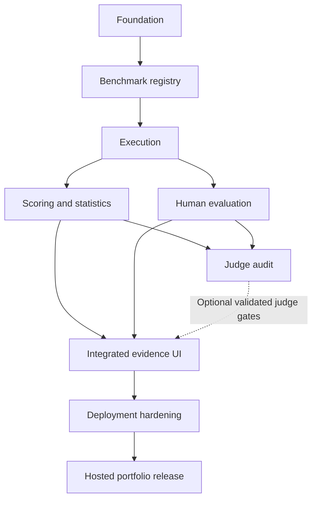

# ADRIVA: delivery plan, acceptance gates and handoff

Architecture baseline 1.0 • Implementation has not started.

## 24–26. Roadmap, dependencies and phase acceptance

Acceptance means demonstrated evidence, not a checked box because code exists. Every implementation phase ends with a short report of changes, executed checks, remaining limitations and the next bounded task. No calendar estimate is promised before the first vertical slice and reviewer pilot establish actual effort.

| Phase | Deliverable | Depends on | Required acceptance evidence |
|---|---|---|---|
| P0 — this phase | Architecture, scientific protocol, logical data model and roadmap | User scope | All 30 requested topics covered; decisions/trade-offs recorded; no results invented; implementation handoff bounded |
| P1 — foundation | Monorepo, API, DB migration infrastructure, web shell, Compose, offline CI | P0 | Fresh setup documented; live/readiness distinction verified; project table migration works on PostgreSQL; frontend builds and shows real service state; no credentials needed; CI runs without model access |
| P2 — benchmark registry | Case schema, provenance, revisioned releases, validation and benchmark UI | P1 | Import valid marked fixtures and reject malformed ones; synthetic+transformed+human-review lineage represented without relabeling; publish is atomic and frozen release resists mutation; cluster leakage and missing license/expected contract block publication; export/import preserves hashes |
| P3 — execution slice | Gateway, fixture adapter, one real provider adapter, durable worker and run UI | P2 | End-to-end fixture run persists exact requests and attempts; concurrent/stale claims cannot select duplicate outputs; crash/restart and cancellation demonstrated; timeouts remain distinct from model judgments; budget caps/unknown usage visible; real calls only with configured credentials and explicit spend budget |
| P4 — scientific core | Task scorers, variant contracts, paired statistics and comparison API | P2/P3 | Hand-calculated edge cases match results; Unicode, negation, entity and number fixtures handled; dependent variants resample together; N/A/errors/missing pairs accounted for; identical fixtures do not create unsupported equivalence without a margin; scorer/config incompatibility blocks comparison; report says fixture where applicable |
| P5 — human evaluation | Blind assignment UI, anchored rubric, immutable ratings, QA and agreement | P2/P3; P4 for integrated reports | Network payloads cannot reveal model mapping or earlier ratings; A/B preference remaps correctly; qualification and independent overlap supported; one-rater/degenerate cases show not-estimable/undefined; alpha implementation checked against published/library reference examples; adjudication preserves original agreement inputs |
| P6 — judge audit | One judge adapter, bias audit and human comparison | P4/P5 plus real independent human sample | Prompt/version/parse errors tracked; swaps and repeats audited; injection cases tested; calibration/evaluation clusters disjoint; held-out human agreement and error tables per supported slice produced from real judgments; unsupported slices remain diagnostic only |
| P7 — integrated product | Regression, language, failure and overview screens; reproducible evidence report | P4/P5; P6 only for validated judge gates | Every plotted value resolves to stored evidence and denominator; pass-to-fail drill-down works; HOLD/BLOCK/equivalent/inconclusive states behave correctly; no fabricated dashboard metrics; report reconstructs from frozen extract; Malayalam and keyboard review visually checked |
| P8 — deployment hardening | Deployed auth, privacy/export controls, recovery, observability, gated CD | P7 | Authorization/IDOR checks pass; dev identity refuses production startup; no secrets in logs/images; database+artifact restore verified; measured pagination/load results published with hardware; fault handling visible; private deployment health/migration rollback procedure rehearsed |
| P9 — portfolio release | Reproducible sanitized demo, README, screenshots, method/data cards, limitations | P7; P8 for hosted multi-user claims | Another person can run fixture demo without a paid account; all fixture/pilot/human evidence labels accurate; no private data/keys in repository or screenshots; real-run report includes sample and uncertainty; capability claims match finished phases |

P5's software acceptance can be met with clearly labeled test records; empirical human-evidence acceptance cannot. If no independent reviewers are available, mark that evidence gate blocked and proceed only with a workflow demonstration. Likewise P6 may have working software while remaining scientifically unvalidated. P7 can ship without judge release gates; it must show missing evidence. P9 may be a local-only demonstration without P8, but cannot claim a secured deployed multi-user product.

### Dependency view

A local portfolio demonstration can branch from P7 after the P9 documentation/privacy checks, with hosted features explicitly absent.

### Acceptance evidence bundles

Store phase report, relevant test command/output summary, schema/build versions, known limitations and screenshots where UI matters. Do not repeatedly run broad tests without a reason; tests should target the new phase's material risks. Keep paid smoke runs separate from CI. Store reference examples with source attribution and expected values; do not validate a statistical function only against itself.

Benchmark content work begins in P2 with marked engineering fixtures. Real pilot authoring/review can proceed after schema stabilizes. Lock evaluation families only when the rubric, metric applicability and generation protocol are usable. Do not spend heavily generating outputs before discovering a bad reference policy.

## 27. Risks and methodological weaknesses

| Risk | Consequence | Mitigation and residual limit |
|---|---|---|
| Synthetic and translated prompts dominate | Results reflect generator habits/translationese | Native-language authoring and origin-balanced reporting; representative coverage remains unproven |
| Small number of independent families | Wide/unstable intervals; rare errors missed | Power/precision simulation and more independent contexts; return inconclusive meanwhile |
| Single Malayalam author/reviewer | Shared linguistic blind spots; no independent agreement | Recruit qualified reviewers; do not invent annotations or claim broad dialect expertise |
| Manglish has variable conventions | String metrics penalize valid language | Reviewed aliases and semantic rubrics; no single canonical Romanization assumed |
| Transformations change intent | Apparent robustness failures are benchmark defects | Explicit invariants and verification; quarantine ambiguous variants |
| Reused passages/variants leak across splits | Calibration and test no longer independent | Source/family clustering before splitting; reviewed duplicate audit |
| Proxy metric is wrong for language/task | Confident invalid conclusions | Validate per slice; keep optional metrics diagnostic until supported |
| Judge and candidate share bias | Correlated errors look like agreement | Independent humans, family disclosure and contrastive audit; no guarantee of unbiased judges |
| Post hoc thresholds/slice selection | Favorable-looking release conclusions | Freeze protocol before evaluation; exploratory tags and multiplicity controls |
| Many task/language slices | Underpowered comparisons and false discoveries | Limited primary gates; publish full counts and uncertainty |
| Model/provider alias changes | Run cannot be reproduced exactly | Snapshot IDs when available, returned metadata/time, frozen outputs; disclose residual uncertainty |
| Retry/cache selection effects | Best-of-many outputs disguised as one attempt | Predeclared first-valid selection, complete attempt history and cache labels |
| Complete-case scoring hides outages | “Quality” appears high while service fails | Separate completion gate, missingness audit and sensitivity analysis |
| Fluency conceals wrong quantities/facts | Preferred response may be task-wrong | Independent deterministic invariants and factual evidence dimensions |
| Cultural-fit rubric encodes stereotype | Unfair penalties across valid varieties | Specify context; allow N/A and disagreement; no demographic inference |
| Fixed curated benchmark overused | Benchmark overfitting | Keep challenge/evaluation governance; document exposure and limit generalization |
| Privacy conflicts with reproducibility | Frozen outputs may need deletion | Tombstones and explicit unreproducible status; deletion can override archival retention |
| Small hardware and API budget | Slow experimentation or interrupted runs | Remote inference, optional heavy models, budget reservations and resumable jobs |
| Scope inflation | Many screens, no trustworthy evaluation | Complete P2–P4 vertical slice before optional integrations |

Open empirical questions: which model/judge supports the actual language mix well; which reference metrics correlate with qualified human judgments; how much reviewer disagreement is acceptable for each use; what practical release margins are justified; how many independent clusters are needed. These cannot be settled honestly by architecture alone.

## 28. What NOT to build

- A translator/chatbot as the main product, a generic RAG system, or a model leaderboard with one unexplained score.
- A foundation model, fine-tuning platform, agent swarm, or proprietary “hallucination detector” claimed to know truth without evidence.
- Kubernetes, Kafka, Spark, Airflow, a vector database or a feature store without a measured workload requiring them.
- Multi-tenant SaaS, subscriptions, billing, marketplace, customer onboarding and complex SSO administration in the first release.
- Automatic promotion/deployment of candidate models based on unvalidated judges.
- Arbitrary code/tool execution from model outputs; browser agents or audio/image/video tasks in the initial scope.
- Dozens of provider adapters before one real adapter and reproducible fixture workflow work.
- Gigantic generated benchmark volume or simulated “human raters” used to decorate performance claims.
- A universal Malayalam grammar/culture score, automatic dialect identification or a claim to cover every speaker group.
- MLflow, LangChain or another framework solely for CV keywords. Add a component only when it solves a documented problem.

## Immediate next task — copy into GPT-5.6 SOL, Medium

> Implement **ADRIVA Phase P1 only**, following this architecture pack. Read README.md and documents 01–06 first. Treat the pack as the design baseline; flag contradictions rather than silently changing methodology.
>
> Start by inspecting the chosen workspace, existing files and AGENTS.md instructions. Check available Python, uv, Node, npm, Docker/Compose, RAM and free disk without modifying unrelated projects. Work in a new ADRIVA repository directory; do not overwrite ADRYN or another project. If GitHub is not configured, keep a local repository and report that limitation; do not publish it.
>
> Create a minimal monorepo with backend/, frontend/, infra/, docs/ and benchmarks/fixtures/. Copy the architecture documents into docs/architecture/. Use Python 3.12, FastAPI, Pydantic settings, SQLAlchemy, psycopg and Alembic; React + TypeScript + Vite; PostgreSQL 18; Node 24 LTS. Resolve and lock compatible exact package versions rather than assuming latest works.
>
> Backend scope: settings, DB connection/session lifecycle, a project table and initial migration, GET /api/v1/health/live and GET /api/v1/health/ready. Liveness reports process state. Readiness returns unavailable when DB connection or expected schema is unavailable, with no secret details.
>
> Frontend scope: a restrained ADRIVA shell with project context placeholder, overview empty state and real backend readiness status. No fake charts, scores, benchmark runs or human activity. Use accessible Malayalam-capable typography; only implemented navigation is interactive.
>
> Infrastructure scope: local Compose setup for PostgreSQL/API/frontend as appropriate, persistent named DB volume, safe .env.example, .gitignore, backend/frontend lockfiles and concise Windows/WSL setup instructions. Bind development services to loopback. No provider API calls, paid tools or local model downloads.
>
> Verification: use targeted tests for health/readiness behavior and a real PostgreSQL migration/integration smoke check; run backend static checks and frontend typecheck/build. Add offline GitHub Actions CI with a PostgreSQL service. Confirm setup commands and errors are understandable to a beginner. If Docker/tool installation is blocked, clearly distinguish checks executed from checks not run; do not claim P1 passes until required checks run in a suitable environment.
>
> Do not implement benchmark ingestion, the whole future schema, model gateway, workers, scoring, human studies, regression statistics, authentication or dashboards in this phase. Retain architecture placeholders in documentation only.
>
> Finish with exact local paths, what works, verification evidence, limitations, and the bounded P2 task. Stop after P1 acceptance review. Do not continue into P2 automatically.

## Clean checkpoint

ASTRA MEDIUM PHASE COMPLETE

NEXT RECOMMENDED MODEL: GPT-5.6 SOL  
EFFORT: MEDIUM

NEXT TASK: Implement P1 foundation only using the prompt above. No routine implementation has been performed in this architecture phase.
