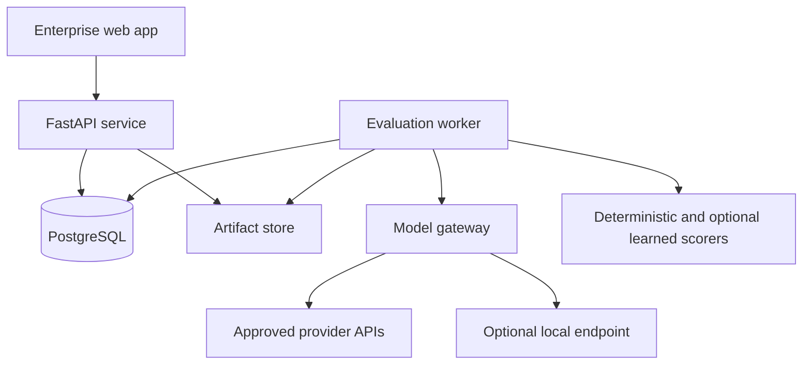
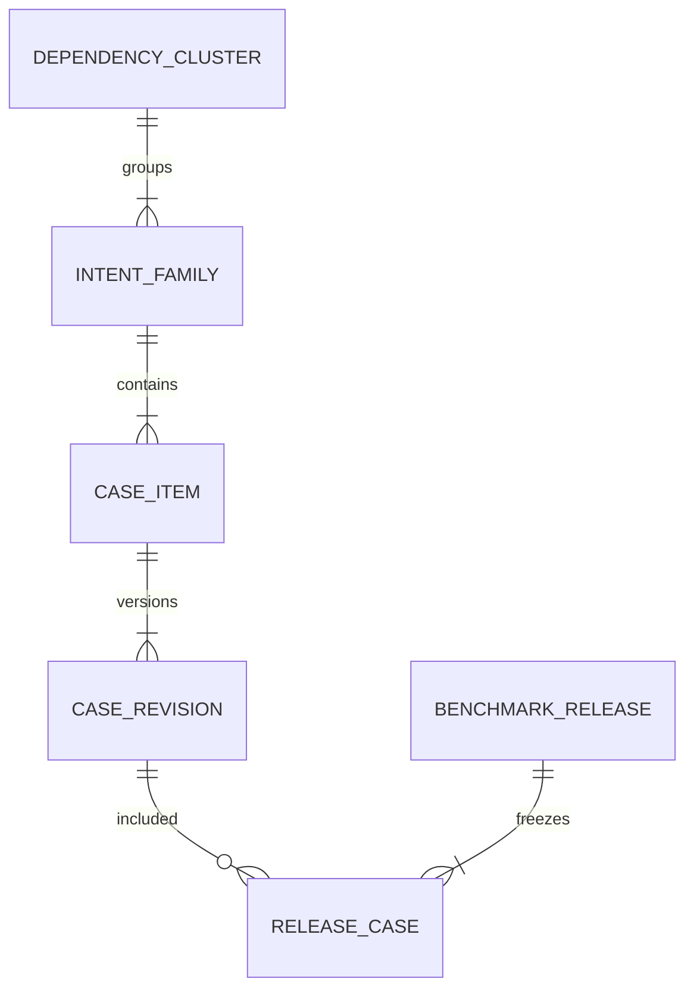
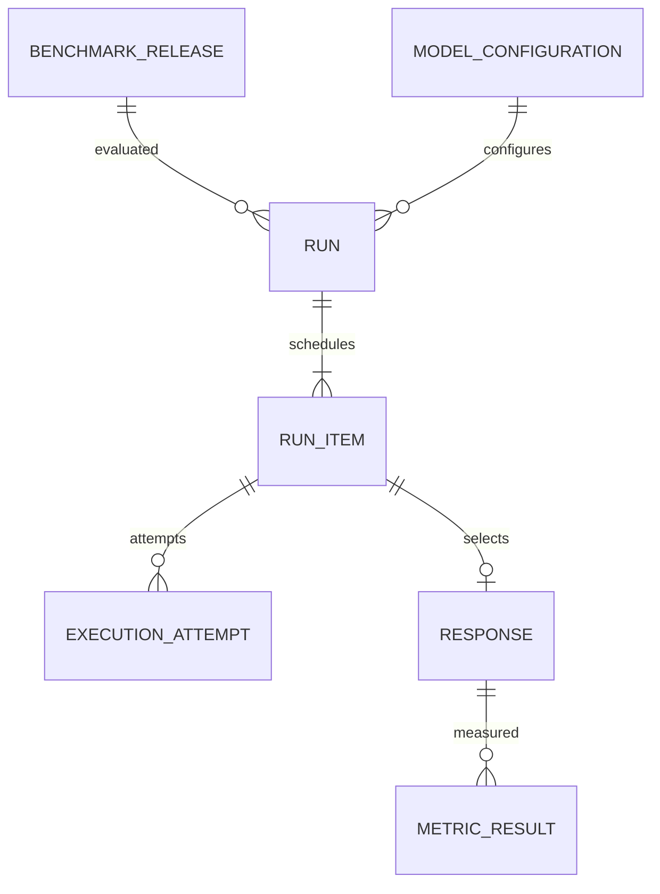
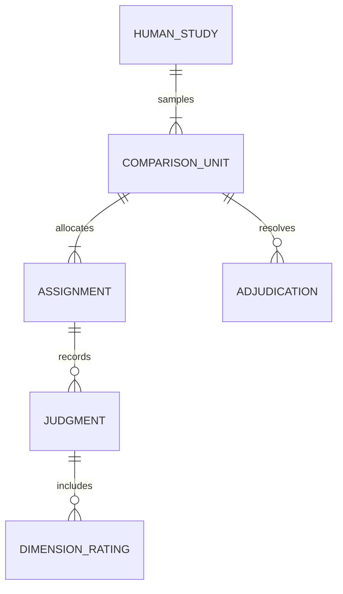
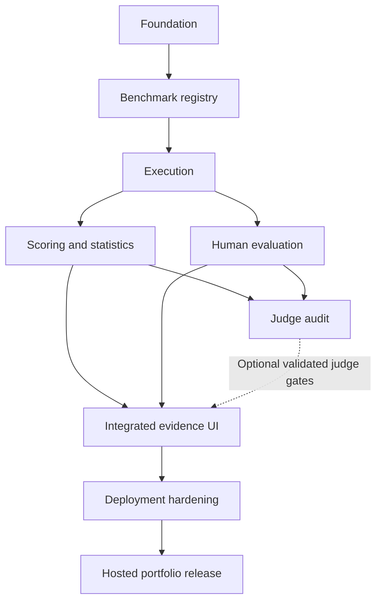

# ADRIVA — architecture and methodology checkpoint

Version: 1.0 • Prepared: 1 October 2026 • Status: design complete; implementation not started.

ADRIVA is a multilingual AI evaluation and release-decision workbench. It produces traceable evidence about changes between model configurations, with controlled English/Malayalam robustness tests and independent human review. It does not certify universal model reliability.

## Reading order

1. [Product and system architecture](01-product-and-system.md): definition, people, workflows, requirements, topology and architectural decisions.
2. [Scientific methodology](02-evaluation-methodology.md): benchmark, taxonomies, scoring, human review, statistics, judge validation and regression gates.
3. [Data architecture](03-data-architecture.md): PostgreSQL entities, relationships, constraints, lineage and analytical SQL contracts.
4. [Engineering design](04-engineering-design.md): gateway, APIs, security, UI, repository and local environment.
5. [Delivery plan and handoff](05-delivery-plan.md): dependencies, phase acceptance criteria, risks, exclusions and next implementation prompt.
6. [Sources and verification](06-sources-and-verification.md): primary sources, limitations and coverage of all 30 requested deliverables.

## Non-negotiable interpretation rules

- No benchmark scores, human ratings, agreement coefficients, release outcomes or performance measurements have been produced in this phase.
- All counts, performance budgets and proposed thresholds in these documents are planning choices, not empirical results.
- Engineering fixtures are always marked FIXTURE and excluded from scientific reports. Synthetic benchmark content retains its origin even after human review.
- Related variants, repeated generations and questions sharing a source are not independent observations.
- A nonsignificant difference is not evidence of equivalence. An unsupported claim is not automatically a proven falsehood.
- Independent human evaluation requires other people. One author's repeated ratings cannot establish inter-annotator agreement.
- The first build targets a local, single-organization application. Production readiness requires completing the later security and operational gates.

## Scope sequence

Build one trustworthy vertical slice: benchmark import → immutable release → two model configurations → deterministic evaluation → paired comparison → inspectable evidence. Add controlled variants, independent human evaluation and judge calibration in subsequent phases. Do not scaffold every eventual feature in the first implementation.

ASTRA MEDIUM PHASE COMPLETE

NEXT RECOMMENDED MODEL: GPT-5.6 SOL  
EFFORT: MEDIUM

NEXT TASK: Implement Phase P1 only: repository foundation, PostgreSQL migration infrastructure, FastAPI health/readiness endpoints, a React application shell, Docker Compose development setup and offline CI. Use the exact handoff and acceptance criteria in 05-delivery-plan.md. Stop before benchmark ingestion, model calls or scoring.

---

# ADRIVA: product and system architecture

Design baseline 1.0 • 1 October 2026 • Normative design, not a claim of completed functionality.

## 1. Final product definition

**ADRIVA — Multilingual AI Reliability, Evaluation & Human Intelligence Platform** is an internal application for evaluation engineers, bilingual reviewers and model-release owners. It compares immutable model configurations on versioned benchmark releases, measures task performance and sensitivity to controlled language changes, collects blind human judgments and explains release risks using inspectable evidence.

The decision ADRIVA supports is: “For this benchmark, task mix, languages, generation configuration and evaluation protocol, does candidate V2 meet our declared release criteria relative to V1?” It must show the scope and uncertainty of that answer. It cannot establish that a model is reliable for all Malayalam speakers or every deployment context.

The distinctive product is a **semantic-intent family**: a verified task expressed in multiple languages, registers, scripts and perturbations. ADRIVA measures preservation of required behavior, not exact matching of the model's words. A second distinctive element is the evidence chain from a release warning to the original prompt, response, scorer, human judgment and benchmark revision.

The product is a workbench, not the deployed assistant under evaluation. “Human Intelligence” refers to reviewer expertise, adjudication and failure analysis; it is not another model metric.

### First credible release

- Four required input modes: English, Malayalam, Romanized Malayalam/Manglish and Malayalam-English code-switching.
- Three primary task tracks: grounded QA, schema-constrained extraction and translation. Instruction constraints are also tagged across tracks.
- Summarization and bounded reasoning follow after scoring and reviewer workflows are stable.
- Small, human-verified pilot plus explicitly marked fixtures; no large synthetic benchmark disguised as validated coverage.
- Two model configurations, a deterministic offline fixture adapter, and one real provider adapter initially.
- One organization with project-scoped access. A local demo is the first milestone, not a SaaS launch.

## 2. User personas

| Persona | Decisions and work | Permissions |
|---|---|---|
| Evaluation engineer | Define task contracts, freeze runs, inspect scoring errors | Manage benchmarks and runs within assigned projects |
| Malayalam/English language reviewer | Check semantic equivalence, fluency and cultural context | Assigned source review and blind annotation only |
| Annotation lead | Calibrate reviewers, inspect disagreement, adjudicate | Assignment administration and QA; restricted access to identities |
| Model-release owner | Compare V1/V2, set margins before testing, accept or block a release | Read evidence, authorize comparison protocols and record decisions |
| Data-quality analyst | Find duplicates, lineage defects, invalid gold answers | Review/quarantine data; cannot silently rewrite releases |
| Platform administrator | Configure provider endpoints, roles and operational policies | Infrastructure and access administration; audited privileged access |
| Portfolio reviewer | Inspect methodology and reproduce a safe demo | Read-only sanitized project; no provider keys or private benchmark access |

The same person may hold several roles locally. Role overlap must not be represented as independent annotation.

## 3. Primary workflows

1. **Create benchmark:** import draft items → validate schema/license/provenance → group shared intents and sources → author expected behavior → verify meaning and reference answers → assign family-level split → freeze manifest and digest. Publication is blocked on unresolved critical quality findings.
2. **Compare models:** select the same release and case revisions → freeze generation and scoring configuration → declare estimands/margins → estimate and cap spend → enqueue balanced/interleaved model requests → retain every attempt → score → check completeness → produce paired evidence.
3. **Test robustness:** choose reviewed baseline and one controlled change → confirm invariant or expected directional change → generate responses under the same protocol → score behavior → aggregate within families → investigate language/perturbation-specific drops.
4. **Collect human evidence:** select probability-based evaluation sample → randomize A/B assignments server-side → independent scoring → lock submissions → compute pre-adjudication agreement → resolve selected disagreements → preserve both original and adjudicated records.
5. **Investigate failure:** open slice → inspect source and response → see automatic finding as unconfirmed or confirmed → attach evidence spans → classify severity → determine model defect versus benchmark/scorer defect → propose a new challenge case for a future release.
6. **Review regression:** compare matched outputs and task gates → show improvements, regressions, equivalence and inconclusive results → identify pass-to-fail cases → review critical failures → record RELEASE/BLOCK/HOLD decision with reasons. ADRIVA never automatically replaces a deployed model.

## 4. Product requirements

| ID | Requirement | Observable acceptance |
|---|---|---|
| R01 | Versioned benchmark and provenance | Any run resolves exact case, source, rubric and manifest digests |
| R02 | Controlled multilingual variants | Each scored variant identifies its parent, operator, invariant and review status |
| R03 | Typed model execution | Raw and normalized requests/responses, errors, time, usage and provider identity retained |
| R04 | Task-aware evaluation | Every score specifies metric version, applicability, evidence and denominator |
| R05 | Blind human comparison | Annotator APIs do not return model IDs, scores or other reviewers' ratings |
| R06 | Annotation QA | Independent overlap, disagreement review and unmodified original ratings supported |
| R07 | Paired inference | Related variants share a resampling cluster; missing pairs remain visible |
| R08 | Regression gates | Comparison refuses incompatible protocol hashes; no p-value-only “same” claim |
| R09 | Failure investigation | A finding links response, taxonomy revision, evidence, author and verification state |
| R10 | Operational resilience | Interrupted work resumes without duplicate logical outputs; attempts remain auditable |
| R11 | Security and privacy | Project access checks, safe exports, secrets isolation and held-out restrictions tested |
| R12 | Reproducible reports | Export includes counts, exclusions, raw estimates, uncertainty, methods and limitations |

Nonfunctional planning envelope: up to 10,000 benchmark cases and 100,000 stored responses on the initial deployment; modest concurrent reviewer usage. These are test targets, not measured capacity. Proposed local database API p95 under 500 ms for paginated reads, excluding generation/scoring; validate with declared hardware and data sizes before claiming this. Use pagination, bounded jobs and cancellation before adding distributed infrastructure.

Accessibility requirements: keyboard operation, visible focus, sufficient contrast, Malayalam-capable fonts, no color-only statuses, clear original/normalized text display, and usable side-by-side review on a laptop screen. Operational targets and retention are configurable and must be published with the environment's limitations.

## 5. System architecture

One backend codebase serves API and worker processes. Domain modules separate benchmarks, execution, evaluation, annotation and reporting. PostgreSQL is the system of record and initial durable queue. ArtifactStore abstracts a local directory first and object storage later. No model request runs inside a database transaction or web request lifecycle.

Run scheduling freezes a manifest and allocates logical response slots before execution. Workers claim short leases, call providers outside transactions, then commit outcomes using lease tokens. Analysis reads an immutable snapshot of completed records. Cancellation stops future work; already completed external calls may still incur cost and must be recorded.

The trust boundary is server-side. The browser never receives provider credentials or hidden A/B mapping. Providers see only approved task payloads. Evaluated text is untrusted content, including when passed into a judge.

## 6. Technology architecture and decision record

All rows are ADRIVA choices; they are not findings that these options outperform alternatives universally.

| ID | DECISION | ALTERNATIVES | WHY SELECTED | TRADE-OFFS |
|---|---|---|---|---|
| A01 | Modular monolith, separate API/worker processes | Microservices; single blocking web process | Clear ownership with manageable local operation | Shared release cycle; future splitting requires stable module interfaces |
| A02 | FastAPI, Pydantic, SQLAlchemy, Alembic | Django; Flask; full TypeScript backend | Python evaluation ecosystem, typed contracts, explicit migrations | More auth/admin assembly than Django |
| A03 | React + TypeScript + Vite SPA | Next.js; Streamlit; Dash | Dense annotation workflows and typed API contracts; no SEO need | Requires frontend engineering; no built-in server rendering |
| A04 | PostgreSQL as source of truth | SQLite; document database | Transactions, relational integrity and serious analytical SQL | Local service and migrations required |
| A05 | PostgreSQL leased jobs initially | Redis/Celery; managed queue | Avoid another service at small scale; durable state near run records | Must implement lease/retry semantics carefully; revisit if polling/locking becomes a measured bottleneck [S07] |
| A06 | Local content-addressed artifacts behind interface | S3 immediately; database blobs | Simple demo and cheap reproducibility | Files and DB need coordinated backup; no high availability |
| A07 | Thin provider adapter interface | Agent framework; gateway framework immediately | Explicit capabilities, minimal implicit behavior | A small amount of adapter code per provider |
| A08 | Native run tracking in PostgreSQL | MLflow; hosted experiment platform | Runs must join annotation and benchmark evidence | Build a small purpose-specific run UI; no broad training lifecycle |
| A09 | Typed relational columns plus bounded JSONB | Everything JSON; one wide table per task | Enforced identity and flexible task payloads | JSON schemas must be versioned; SQL is less simple for arbitrary payloads |
| A10 | Deterministic metrics first; humans for semantic judgments | Universal judge score; embeddings as truth | Testable and interpretable evidence | Human work limits scale; some results stay unknown |
| A11 | Family/source-cluster inference | Treat all variants as independent | Protect confidence estimates from duplicate semantic content | Effective sample size is smaller; wider honest intervals |
| A12 | Frozen benchmark releases and separate calibration split | Continuously edited live benchmark | Prevent moving-target comparisons and leakage | Corrections require new releases and reruns |
| A13 | Dimension-specific results and explicit release gates | Universal weighted “reliability score” | No arbitrary mixing of language quality, factuality and availability | More evidence for release owners to interpret |
| A14 | Single organization, project roles initially | Multi-tenant SaaS; unrestricted demo users | Sufficient portfolio scope without tenant isolation claims | Multi-tenancy requires a separate security design |
| A15 | Logs, health, metrics first; tracing as needed | Full observability platform immediately | Debug actual failure modes without large stack | Cross-service tracing limited until deployment needs it |
| A16 | Portable Compose deployment | Kubernetes; serverless orchestration | Reproducible dev and small hosted evaluation service | One-host failure domain; no automatic HA |

External foundations: PostgreSQL documents queue-style use of SKIP LOCKED [S07]; FastAPI documents independent deployment concerns [S10]. Neither source establishes ADRIVA's proposed performance or reliability; those need testing.

## 7–8. PostgreSQL/data architecture and ER model

The full design is in 03-data-architecture.md. A benchmark release references immutable case revisions. Runs reference releases and immutable model configurations. Responses reference run items and generation attempts. Scoring executions and human studies reference responses, rather than writing one mutable score into a response row. Comparisons reference analysis protocols and evidence snapshots. This structure lets ADRIVA distinguish model changes, benchmark changes and evaluator changes.

For a production-style portfolio, the strongest engineering demonstration is a trustworthy evidence path, database integrity and documented failure recovery—not the number of services in the diagram.

---

# ADRIVA: evaluation methodology

Protocol design 1.0 • No evaluation results exist yet. Source IDs resolve in 06-sources-and-verification.md.

## 9. ADRIVA-BENCH methodology

### Measurement contract

Every case defines task, input, relevant context, required output behavior, allowed alternatives, applicable metrics, reference/evidence, language requirements and severity policy. Benchmark items are measurements with limitations, not merely prompts. Do not score a property unless the case provides enough evidence to assess it.

Two tracks remain separate:

- **Controlled track:** curated behavior tests and related language variants. Supports diagnosis and comparisons on that suite; not population prevalence claims.
- **Naturalistic track:** rights-cleared prompts sampled from a declared source population, if later available. Publish sampling frame, dates and selection/exclusion process. Do not call synthetic prompts real user traffic.

Start with a proposed pilot of 60 independent intent families, 20 in each initial primary task. Aim for four core input modes per family, plus one reviewed single-factor perturbation: approximately 300 cases if all variants prove valid. This count is a workflow budget, not a power calculation or sufficient sample claim. Invalid variants reduce counts; do not fill quotas with unverified rewrites. Translation tracks must record direction and expected output mode; some comparisons require separate strata.

For the pilot, assign approximately 30 families to development, 15 to scorer/judge calibration and 15 to a locked smoke-evaluation split. The last split is far too small to promise precise release inference across all slices. Expand the independent evaluation families after variance and annotation-time estimates exist. A frozen pilot can demonstrate a rigorous workflow while returning INCONCLUSIVE.

### Case record and publication checks

Required: stable case ID, revision, family ID, dependency cluster ID, primary task, secondary capabilities, input/output language profiles, original prompt and context, source IDs, expected constraints, reference answers or explicit no-reference status, provenance lineage, author, license/permission, sensitivity, split, transformation record, review record and content hash.

Publish only after schema, required fields, UTF-8 integrity, duplicate and split-leakage checks pass. Human review must check the answer contract as well as the wording. Source-grounded tasks retain evidence snapshots and citations, including retrieval date where relevant. Use stable fictional scenarios for initial grounding; exclude current-world knowledge claims without dated evidence.

Review statuses: DRAFT → VALIDATED → REVIEW_REQUIRED → VERIFIED → FROZEN. REJECTED/QUARANTINED is an explicit branch, not a silently removed row. A valid mechanical transformation may be reviewed in a batch, but semantic intent must still be verified before it enters the trusted robustness track.

### Provenance is multidimensional

| Requested label | Representation | Meaning |
|---|---|---|
| HUMAN_CREATED | creation_origin | A person authored the case; assisted edits are disclosed |
| SYNTHETIC | creation_origin | A generator authored content; retain generator and prompt version |
| PUBLIC_DATASET | creation_origin | Imported dataset revision, item ID, source and license retained |
| TRANSFORMED | derivation event | Parent case, operator/version, parameters and creator retained |
| HUMAN_VERIFIED | review event/status | Named/pseudonymous real reviewer, rubric, time and outcome retained |

These are not five mutually exclusive origins. A SYNTHETIC case may be TRANSFORMED and then HUMAN_VERIFIED. It never becomes HUMAN_CREATED retrospectively. Human verification of a prompt is also different from human evaluation of a model response. FIXTURE is a separate usage class for engineering tests, excluded by default from all scientific aggregates.

### Leakage controls

Split by dependency cluster, not case row. Shared source passages, translations, close paraphrases and generated variants stay together. Establish clusters before splitting; perform exact hashes, normalized hashes and reviewed near-duplicate search across splits. If a source links multiple families, all share one cluster. Prompt tuning uses development only; thresholds and judge calibration use calibration only. Locked evaluation is not used to repair prompts repeatedly. New failure-derived cases enter a disclosed challenge release; they do not retroactively prove generalization.

Benchmark authors may know the public suite; that cannot be undone. A private split helps process discipline but does not prove provider training-data non-contamination. Record possible exposure and avoid claims of contamination-free evaluation.

## 10. Task taxonomy

One primary task per case avoids double counting; capability tags may overlap.

| Primary task | Required gold/evidence | Main outcomes | Limits |
|---|---|---|---|
| Grounded QA | Source passage, answerability, accepted answers, supporting spans | Answer correctness, abstention correctness, support, completeness | Groundedness does not guarantee real-world truth of the passage |
| Information extraction | Field schema, typed gold values, alias/normalization policy | Field exactness, precision/recall/F1, required-field and schema pass | Macro and micro summaries both needed; formatting and content separate |
| Translation | Source, target language/register, reviewed references and semantic units | Fidelity, omissions/additions, entities/numbers, naturalness | Reference overlap is not sufficient evidence of meaning preservation |
| Summarization | Source, key content units, length/task constraints | Supported claims, content coverage, constraints, human coherence | A short empty summary can avoid false claims while failing completeness |
| Instruction following | Explicit objectively checkable constraints plus rubric | Per-constraint pass and all-required pass | “Good answer” is not an executable constraint |
| Bounded reasoning | Solvable synthetic or reviewed problem, final answer, accepted verification | Answer/checker correctness; short verifiable rationale if requested | Do not infer internal reasoning from fluent explanation; no hidden chain-of-thought required |

Open-domain factual QA is deferred until source collection and evidence aging exist. Tools/code execution by evaluated models are out of scope for the initial release. Translation and summarization are evaluation tracks, not end-user translator products.

## 11. Language taxonomy and controlled robustness

Language, script, register, mixing and noise are separate axes. Store input profile and requested output profile independently.

| Axis | Initial values |
|---|---|
| Language composition | English; Malayalam; Malayalam+English; unknown |
| Script | Latin; Malayalam; mixed; other |
| Register | Formal; conversational; colloquial; unspecified |
| Mixing | None; lexical borrowing; within-sentence; between-sentence; ambiguous |
| Romanization | Not applicable; conventional scheme if specified; informal Manglish |
| Transformation | Translation; register shift; paraphrase; spelling noise; typing error; punctuation; code-switch; transliteration |
| Locale metadata | Kerala context when supplied; dialect/community only when known and consented, never inferred from identity |

Use `en`, `ml`, `ml-Latn` as applicable language/script tags. Represent code-switching as a composition of languages with optional spans; do not invent an ISO language code for “Manglish.” Romanized Malayalam and English mixed with Malayalam are not the same condition. Automatic language identification is an auxiliary flag, not ground truth for short or mixed text.

### Transformation contract

Each operator stores parent revision, seed/configuration, exact changed span, intended invariant, expected direction if any, severity and a verification result. Preserve task facts, negation, entities, units, quantities and constraints unless the experiment intentionally changes one. Single-factor tests precede combined stress tests. A punctuation deletion that changes sentence meaning is not an invariance test. An ambiguous typo must be quarantined or assigned a different answer contract.

Three test relationships, inspired by behavioral testing [S01]: minimum-capability tests, invariance tests and directional tests. Formal/conversational language may preserve factual intent while legitimately changing tone; score factual invariants and register expectations separately. English-to-Malayalam rewriting is not automatically semantically equivalent just because a model translated it.

For family f, baseline behavior score b_f and applicable variant scores v_fk, define D_f = mean_k(v_fk − b_f), using a frozen operator weighting scheme. Report mean D_f across families, with cluster-aware intervals. Also report:

- Variant pass rate among all eligible variants, macro-averaged by family.
- Baseline-pass → variant-fail transition rate, with its restricted denominator.
- Baseline-fail → variant-pass rate and unchanged fail rate.
- Fraction of families passing every required variant, only when required variant sets match.
- Worst-language or worst-operator slice with counts and uncertainty, not just the overall mean.

Conditioning on baseline passes answers a narrow question and can hide weak baseline performance; show the unconditional result beside it. For V2-versus-V1 robustness, compare family penalties: (variant−baseline)_V2 − (variant−baseline)_V1. Do not count each reused baseline as another independent observation. If variant sets differ, analyze a preregistered common subset and disclose exclusions.

## 12. Failure taxonomy

Multi-label findings; one outcome can have several supported labels. Severity is independent: MINOR (small usability impact), MAJOR (material task failure), CRITICAL (predeclared serious consequence). Criticality follows the scenario, not an automatic scary-word heuristic. Counts of labels must never be summed and presented as unique failed cases.

| Label | Operational definition and evidence |
|---|---|
| Meaning Drift | Response alters a required proposition, relation or intent; identify source and changed claim |
| Instruction Drift | Ignores or changes an explicit task constraint; link the constraint ID |
| Hallucination | Fabricated/unsupported asserted content under the task's evidence contract; link claim and unsupported/contradicted status |
| Factual Error | Claim contradicted by trusted reference evidence; absence of support alone is insufficient |
| Entity Preservation Failure | Required identity is lost, substituted or mislinked after allowed aliases/transliteration |
| Number Preservation Failure | Required quantity, date, unit or numeric relation changes outside allowed conversion/tolerance |
| Over-Literal Translation | Surface rendering distorts intended idiom or function; bilingual evidence required |
| Unnatural Language | Awkward usage for requested register despite understandable meaning; qualified language review |
| Grammar Error | Syntax/morphology violates target-language expectations; do not penalize permitted code-switch conventions |
| Code-Switch Failure | Mixing violates requested mode or loses meaning/coherence at switch boundaries |
| Transliteration Failure | Romanization changes identity/meaning or violates a required scheme; allow legitimate informal variants |
| Cultural Misinterpretation | Misreads a context-dependent convention or reference; record context and reviewer rationale |
| Omission | Missing required semantic unit or answer field |
| Unsupported Addition | Adds material absent from source/task permission; may be true yet inappropriate |
| Format Failure | Violates output schema or explicit structural requirement |
| Contradiction | Incompatible statements within response or with authoritative task context |
| Inappropriate Refusal | Declines an answerable allowed task without task-supported reason |

Hallucination is an umbrella finding, not a separate count to add to unsupported additions. Preserve subtype `unsupported`, `contradicted`, or `fabricated_evidence`; only evidence-backed claims receive confirmation. Store detector proposal separately from human confirmation. Execution timeout, truncation and provider refusal codes are operational events; a successful model refusal may additionally be a task failure if the rubric warrants it.

## 13. Automatic evaluation methodology

### Layers and applicability

1. Validate execution and payload status. A missing response has no language-quality score.
2. Deterministic constraints: parse schema, required fields, counts, exact accepted answers, numeric values/units and permitted entity aliases.
3. Reference-based diagnostics: chrF for translation when a reviewed target reference exists [S02]; optional lexical summaries for debugging, never universal quality gates.
4. Optional learned signals: multilingual embeddings for duplicate discovery/failure grouping; translation quality models only after checkpoint-specific language validation. COMET is an MT evaluation framework, not proof of validity for ADRIVA's Manglish slices [S03].
5. Validated judge or human assessment for semantics and naturalness. Until validated, automatic semantic findings remain provisional.

Metric result types: VALUE, NOT_APPLICABLE, INSUFFICIENT_EVIDENCE, SCORER_ERROR. Keep numeric nulls distinct from zero. Store metric revision, input hashes, normalizer version, direction, units, range, decision threshold if any and evidence. A metric returning an error is never silently omitted from its coverage denominator.

Unicode policy: preserve original text and derive a versioned normalized copy; start with NFC, but test Malayalam combining forms and chillu variants explicitly. Do not strip joiners, punctuation or case blindly. Numeric matching uses Decimal and explicit locale/unit rules; comparison of unordered digit bags is invalid. Entity matching uses reviewed aliases and relations, not only string presence. No universal edit-distance threshold for informal Manglish.

Extraction reports exact field accuracy and typed value correctness, with micro and per-case macro F1 where appropriate. QA separates answerable and unanswerable cases. Empty/no-answer outputs cannot pass all tasks by avoiding claims. Summarization reports claim support and required-content coverage together. Factuality requires a trusted evidence source; groundedness asks whether provided evidence supports the response. Neither an embedding cosine nor a fluent judge explanation establishes truth.

For claim-based diagnostics report unsupported evaluated claims / evaluated claims, plus claim-extraction coverage and unsupported-response incidence. A response with no extractable claims is N/A for claim precision and still assessed for answer completeness. Do not describe this as the true hallucination rate if claim extraction/judgment is incomplete or unvalidated.

Golden scorer tests must include semantically correct alternative wording, wrong negation with high lexical overlap, changed numbers, transliterated entity aliases, empty answers, malformed JSON, Unicode variants and unsupported statements. Label these engineering fixtures explicitly.

## 14. Human evaluation methodology

### Blind study design

Freeze study protocol, response set, rubric, eligibility and sampling before assignment. Use at least two independent qualified reviewers for the primary overlap set; prefer three on the calibration/disagreement subset when available. Human agreement is NOT ESTIMABLE with one reviewer, however often that person repeats a rating.

Reviewers qualify separately for Malayalam, English and mixed-script work using reviewed practice items and rubric discussion. Self-reported language fluency alone is not sufficient evidence of rating consistency. Avoid having case authors be the only reviewers of their own examples. Record conflicts, training and proficiency; do not collect irrelevant identity attributes.

Each unit shows task/context, permitted references, Response A and Response B. Hidden model IDs, provider names in metadata, generation time, costs, automatic scores and other ratings are unavailable to the annotator API. Randomize A/B order per unit and reviewer, balance across a study, and store the mapping server-side. Model-written self-identification can compromise blinding; record suspected unblinding. Never rewrite substantive answers silently to hide identity.

Rate dimensions for each response, then overall preference: A, B, TIE, or CANNOT_JUDGE. A tie means comparable quality; cannot-judge means insufficient evidence/expertise. N/A means the dimension is inapplicable. These states are not interchangeable.

| Dimension | 1: unacceptable | 3: mixed/adequate with material issue | 5: fully meets requirement |
|---|---|---|---|
| Meaning preservation | Core intent changed | Main meaning retained with an important loss | Required meaning and relations retained |
| Naturalness | Very difficult/unnatural | Understandable but awkward | Natural for requested register |
| Grammar | Errors impede comprehension | Some consequential errors | No material grammatical issue |
| Factuality | Major contradicted claims | Mix of correct and problematic claims | All assessable claims supported by truth evidence |
| Instruction following | Core instruction ignored | Some constraints missed | All applicable instructions met |
| Cultural fit | Material contextual misinterpretation | Context fit uneven | Fits explicit context without stereotyping |
| Completeness | Required content largely absent | Some required units absent | All required units covered |

Scores 2 and 4 represent intermediate severity between adjacent anchors; task-specific examples are mandatory before a study. Factuality is N/A or cannot-judge where evidence does not allow assessment. Cultural fit is N/A for tasks with no cultural requirement. Use a separate groundedness judgment for source entailment when needed. No single mandatory average across these ordinal dimensions.

Require a short rationale and evidence span for major/critical findings and pairwise preferences where feasible. Submission locks the original record; later changes create amendments. Adjudicators see disagreement only after independent submissions. Adjudication creates a separate resolution, including “rubric ambiguous” or “benchmark defective”; it never overwrites original ratings used for agreement.

### Sampling and annotation QA

Maintain a random stratified sample by task and language for overall judge validation and quality estimation. Store sampling probabilities. Keep a separate purposive sample enriched for disagreements/failures; report it as diagnostic, never as population prevalence. If estimates combine unequal-probability sampling, apply declared weights and a compatible uncertainty method.

Use small blinded repeat and reviewed attention-check subsets to inspect within-reviewer consistency, not to inflate the independent sample. Review unusually short completion times as a signal, not automatic fraud proof. Track skip rates and workload. Exclusion rules must be set before outcomes; publish the effect of exclusions and retain audit history. Estimate annotation cost from timed practice sessions, not guessed ratings-per-hour.

## 15. Statistical methodology

### Define what is being estimated

Primary comparison: difference in a specified task success rate between V2 and V1 on matched cases, aggregated with frozen family/slice weights. Report operational completion separately. The default statistical unit is the highest known dependency cluster (source cluster containing one or more intent families); variants and repeated generations stay inside it.

Report case count, family count, cluster count, repetitions, score coverage, slice counts, weights and exclusions. An empirical score on a fixed curated suite is descriptive. Cluster intervals describe a stated generalization model over comparable clusters; they do not convert a convenience benchmark into a representative survey of Malayalam users.

### Paired uncertainty and effect sizes

- For each model, aggregate repetitions within case and variants within family according to the protocol. Retain pairing between configurations.
- Use paired stratified cluster bootstrap for mean-score and pass-rate differences: resample dependency clusters with replacement, retain all paired observations, recompute the declared estimator. Start with 5,000 seeded draws; record method/draws and validate Monte Carlo stability near gates. This is ADRIVA's clustered extension of paired resampling practice [S04].
- Strata used for resampling must be nonoverlapping at the cluster level. If a cluster spans language slices, resample the cluster once and derive all language estimates together; never sample its languages independently.
- Primary effect sizes: absolute percentage-point difference for rates, raw score difference for continuous measures, preference advantage over 0.5 for pairwise judgments. Avoid standardized effects that obscure the original meaning.
- Exact McNemar is optional only for independent paired binary units with one valid outcome per unit; applying it to every dependent variant is invalid [S06]. For family-aggregated nonbinary scores, use cluster resampling instead.
- Treat ordinal ratings with distributions, ordinal agreement and paired preference as primary. Any mean-rating summary explicitly assumes approximate equal spacing and is secondary.

For human preference, map A/B to canonical model identity before analysis. Report V2 wins, V1 wins, ties and cannot-judge separately. A tie-adjusted descriptive rate is (wins + 0.5 × ties)/(wins + losses + ties); cluster over families, not individual ratings. It is not a calibrated probability that V2 is objectively correct.

Default intervals: 95% descriptive confidence intervals. For multiple release gates, use a preregistered multiplicity strategy, initially Bonferroni simultaneous intervals over the finite primary gate set; conservative but straightforward. Exploratory slice tests may use Benjamini–Hochberg adjusted p-values with an explicit dependence caveat and remain exploratory. Never choose the best-looking slice post hoc and relabel it primary.

### Equivalence and release inference

Normalize orientation so positive Δ always means V2 is better. Declare a smallest practically meaningful change δ before looking at evaluation outputs. There is no universal justified δ for all tasks; a release owner must set it from use-case harm and tolerance. Until set, show estimates and INCONCLUSIVE, not a release recommendation.

For a chosen appropriate confidence interval [L,U]:

- Meaningful improvement if L > δ.
- Meaningful regression if U < −δ.
- Practical equivalence if the entire interval is strictly inside [−δ,+δ].
- Otherwise inconclusive about meaningful change. A statistically detectable but smaller effect can coexist with practical equivalence.

Formal equivalence tests require explicit margins and compatible assumptions; paired TOST documentation [S05] is a reference, not permission to feed dependent variants into a t-test. ADRIVA initially uses the conservative interval containment policy above. A non-inferiority release gate requires L > −δ and is labeled “non-inferior within margin,” not “equivalent.”

### Sample size and stochastic outputs

Use pilot cluster differences to simulate power/precision for planned margins, imbalance and within-family dependence; expand independent families, not just paraphrases. No universal minimum n or guaranteed power is asserted. Very small/degenerate cluster samples get descriptive results and an insufficient-evidence flag; a constant observed outcome does not establish zero risk. For truly independent zero-event units, an exact binomial bound can be supplemental; do not use naive binomial bounds on dependent variants.

Initial generation repeat count is one per model/case for cost control; this characterizes observed responses, not stochastic reliability. For a preregistered stochastic subset, use at least three proposed repeats and assess whether more are needed; model seeds may not be supported or deterministic. Repeated outputs remain nested in cases. Interleave/randomize model execution to reduce time/provider drift confounding; retain timestamps and returned version metadata.

Timeouts and rate-limit failures are not hallucinations. Report completion rates, paired semantic results, missingness by slice and worst/best-case sensitivity bounds where useful. A successful-call-only result cannot pass release gates if required completion coverage fails. Do not impute missing semantic ratings as measured zero; a separately labeled end-to-end task-success gate may count noncompletion as failure.

## 16. Inter-annotator agreement

Default: Krippendorff's alpha, nominal for canonical pairwise preference labels and ordinal for anchored dimension ratings. It accommodates multiple raters and missing ratings with an appropriate distance function [S08]. Do not encode A/B/TIE as ordered quality levels. For exactly two fixed reviewers, Cohen's kappa (nominal) or explicitly weighted kappa (ordinal ratings) may be secondary diagnostics.

Compute agreement on original overlapping judgments before adjudication. Report number of reviewers, rated units, overlapping units, language/task distribution, missing/cannot-judge frequency, category prevalence and raw agreement alongside alpha. Exclude N/A from applicable dimensions, and publish its rate. A study with all one category can make chance-corrected coefficients undefined; report UNDEFINED, not 1.0. Negative agreement is allowed and must not be clipped.

Resample dependent families/clusters with all their ratings for an approximate interval; disclose instability for small sets. Such intervals generalize over items conditional on the observed reviewers, not a broad reviewer population. Reviewer-population inference would require a larger crossed design and additional modeling. No universal alpha threshold certifies validity. Low agreement triggers rubric/language/evidence review, not automatic removal of dissenting raters. High agreement can still mean shared error.

Investigate disagreements by dimension, language, task, reviewer pair, ambiguity and factual evidence. Separate rubric ambiguity, reviewer expertise gaps, multiple valid answers, source defects and model ambiguity. Fixing a rubric creates a new rubric revision and possibly a new study; retain the original coefficient.

## 17. LLM-as-Judge methodology and bias controls

Judge output is a fallible measurement. Position, verbosity and self-preference biases are documented concerns [S09]. ADRIVA does not inherit a paper's agreement rate or assume it transfers to Malayalam.

Use an immutable judge configuration: model identifier, returned provider metadata, prompt hash, rubric revision, schema, generation parameters and evidence permissions. Ask for dimension verdicts, short evidence-based rationale and cannot-judge; no hidden reasoning trace is needed. Validate JSON and evidence spans. Parse failure or missing evidence is an error, not a pass. Candidate text is delimited untrusted data; judge has no tools or network access for the initial design.

Calibrate on independently rated calibration families, then evaluate on a separate locked human-reviewed sample. For each applicable language/task slice report confusion matrices, false-positive/negative behavior for critical labels, agreement, score/rank associations where appropriate, abstention and coverage, with uncertainty. Calibration thresholds are selected on calibration only. A judge with unestablished validity in Manglish cannot be a release gate for Manglish.

| Bias or failure | Planned control and evidence |
|---|---|
| Position | Judge both A/B orders on the audit subset; map identities before comparing; report reversal rate |
| Verbosity/style | Human-verified equal-quality content with controlled length/style changes; investigate preference shifts |
| Self/family preference | Record judge/candidate families; cross-family judge where feasible; disclose unavoidable overlap |
| Language preference | Matched human-verified multilingual cases; slice errors rather than assume English calibration transfers |
| Reference anchoring | Include valid alternative answers and intentionally flawed references in clearly separated diagnostic fixtures |
| Prompt injection | Adversarial quoted instructions in candidate text; no execution privileges; check judge task compliance |
| Instability | Repeated audit judgments with stored parameters; variability remains visible |
| Severity blindness | Curated number, negation, omission and fabricated-citation errors with expert labels |

Order disagreement results in UNSTABLE/REVIEW_REQUIRED for a pair, not selecting the convenient order. Multiple judges from similar model families can share bias; a panel is not automatically independent validation. Human reference judgments also have uncertainty and require QA. Optional judge self-confidence is not a calibrated probability.

Architectural choice: one judge integration plus swap/repeat audit first. Alternatives: large judge ensemble or a learned reward model. Selected for inspectability and budget. Trade-off: limited coverage and throughput until human validation expands.

## 18. AI regression-testing methodology

Before execution, freeze a comparison protocol containing baseline/candidate configuration hashes, release manifest, case set, scorers, rubrics, generation repetitions, weights, primary slices, margins, completion requirements, critical failure policy and exclusion rules. Compare like-for-like scoring revisions; if scorers change, rescore both stored response sets and create a new analysis revision. Never compare V1 old scorer scores with V2 new scorer scores without labeling the confound.

The report contains:

1. Compatibility and data-quality checks, with explicit pass/block reason.
2. Matched sample accounting, operational failure rates and costs.
3. Per-task/language effects, intervals, gate classifications and multiplicity policy.
4. Paired transition table: pass→pass, pass→fail, fail→pass, fail→fail, plus missing/unscorable.
5. Hallucination/unsupported-content diagnostics and their validation status.
6. Robustness penalty change, applicable variant sets and language-specific failures.
7. Human preference and agreement evidence, or NOT AVAILABLE.
8. Critical case list, dispositions and unresolved evidence gaps.

Statistical similarity is reported only as practical equivalence within declared margins. A previously passing case now failing is a **case regression** even if aggregate evidence is inconclusive; repeated execution may establish whether it is persistent or stochastic. Do not conflate a single sampled transition with a deterministic model property.

Release state: BLOCK for incompatible evidence, violated hard rules or confirmed disallowed critical regressions; HOLD for insufficient coverage, missing human evidence or inconclusive mandatory gates; ELIGIBLE_FOR_REVIEW when all specified gates meet criteria. Final RELEASE is a signed human decision, not automatic deployment. Exceptions remain explicit overrides; the failed underlying gate remains visible.

## 19. Benchmark versioning strategy

Store immutable item revisions and immutable ordered release manifests with SHA-256 hashes over a specified canonical serialization. Each release pins schema, taxonomy, transform, split and rubric versions; metric and generation configurations are separately frozen in run/analysis protocols.

Proposed semantic labels: MAJOR changes task interpretation, sampling or gold policy enough to break direct comparison; MINOR adds/removes/corrects score-affecting cases within the same broad protocol; PATCH changes only non-scoring documentation/metadata. Any input, reference, split, weighting or constraint change produces a new score-affecting release, never a silent patch. Labels communicate intent; hashes establish actual identity.

Cross-release scores are not directly comparable by default. Permit a clearly labeled intersection analysis only when case revisions and all scoring contracts match, showing excluded coverage; the intersection may not represent either full release. Retire leaked or defective releases without deleting history. Deletion for privacy can tombstone sensitive payloads and mark affected runs non-reproducible; privacy deletion takes precedence over perfect archival reproducibility.

Further methodological decisions: curated families over scraped volume (cost: limited coverage); dimension rubrics over a universal score (cost: more interpretation); independent reviews over synthetic reviewer agents (cost: recruitment); validated proxies over automatic truth claims (cost: unscored cases). These constraints are deliberate quality controls.

### Additional scientific decision record

| DECISION | ALTERNATIVES | WHY SELECTED | TRADE-OFFS |
|---|---|---|---|
| Factorized language/script/register labels | One flat language enum | Separates Romanization from code-switching and noise | More metadata and reviewer work |
| Origin plus derivation plus review events | One provenance category | Preserves synthetic origin after real verification | More relations and validation rules |
| Ordinal alpha for dimension ratings | Pearson correlation; unqualified percent agreement | Models disagreement with the specified measurement level; handles incomplete overlap | Sensitive to category prevalence and distance definition; undefined cases possible |
| Independent blind ratings before adjudication | Consensus discussion first | Measures actual disagreement and reduces anchoring | Slower and requires multiple qualified people |
| Cluster-aware paired intervals | Independent-row t-tests; bootstrap all rows | Preserves shared-intent/source dependence and model pairing | Fewer effective observations and wider intervals |
| Margin-based classifications with conservative primary gate intervals | Nonsignificant means same; unadjusted many-slice tests | Separates practical equivalence, non-inferiority and lack of evidence | Requires justified margins and larger samples |
| Frozen held-out evaluation after calibration | Tune scorer on every observed failure | Limits optimistic evaluation and post hoc threshold selection | Needs new held-out families as iteration continues |
| Embeddings only for retrieval/grouping initially | Cosine similarity as factuality/fidelity gate | Similarity can overlook negation and quantities | Less automated semantic coverage |
| Task-specific evidence for factuality and support | Judge world knowledge as truth | Makes evidence inspectable and unknowns explicit | Evidence authoring and aging cost |
| Separate representative and failure-enriched samples | Merge all annotated items into one accuracy estimate | Avoids biased prevalence estimates | Two sampling/reporting paths |

Any change to these choices requires an architecture decision update and, if score meaning changes, a new evaluation protocol revision.

---

# ADRIVA: PostgreSQL and data model

Logical schema specification; no migrations or application code have been created.

## 7. Data architecture conventions

PostgreSQL is authoritative for identity, lineage, states and scores. UUID primary keys; timestamptz in UTC; numeric for money and exact values; text for original multilingual content; JSONB for validated task payloads and provider metadata. Use explicit text/check constraints or reference tables for evolving taxonomies. Secrets are references to server configuration, never database plaintext values.

All project-owned entities carry project_id directly, with project-consistent composite foreign keys where appropriate. Authorization checks are mandatory at API and service boundaries. One organization is the initial deployment model. Project isolation is not a claim of secure multi-tenancy. Use a non-owner application database role, a separate migration role and restricted annotation queries/views.

Normalized relations handle joins, uniqueness and permissions. JSONB does not replace foreign keys. Draft revisions can change before publication; frozen content, model configurations, scoring definitions and submitted judgments are append-only. Runtime lifecycle rows may update state using compare-and-swap/lease predicates. Audit events capture actor, action, entity and timestamp without duplicating private payloads unnecessarily.

## 8. Entity model

All tables below have an id unless a composite key is specified. Common project_id/created_at fields omitted for readability. Build each group only when its phase starts.

### Identity and benchmark entities — P1/P2

| Entity | Main fields and foreign keys | Key invariants |
|---|---|---|
| project | name, slug, settings_revision | Unique slug; settings changes audited |
| user_account | external_subject or local identity, display_name, state | Never store provider credentials; deactivate without destroying ratings |
| membership | user_id, project_id, role | Unique user/project/role; roles explicit |
| source_record | source_kind, URI, external_revision, item_key, license, permission_note, sensitivity, artifact_id | URI alone is not immutable evidence; rights state required |
| dependency_cluster | project_id, reason | Highest known independent sampling group |
| intent_family | dependency_cluster_id, primary_task, description | All variants share family; connected source families share cluster |
| case_item | family_id, stable_key | Stable identity across revisions |
| case_revision | case_item_id, revision_no, parent_revision_id, input_profile, output_profile, prompt, context, task_payload, expected_contract, usage_class, creation_origin, digest | Unique item/revision; immutable once frozen; bounded validated JSON |
| case_source | case_revision_id, source_id, role | Multi-source lineage, e.g. context versus reference |
| derivation_event | child_revision_id, parent_revision_id, operator_revision, parameters, intended_relation, invariant, generator_config_id nullable | Acyclic lineage; transformed status does not replace origin |
| case_review | case_revision_id, reviewer_id, rubric_revision_id, review_kind, verdict, rationale, submitted_at | Real review event; verification cannot be a free-text provenance badge |
| benchmark | name, purpose, owner_id | Container for releases |
| benchmark_release | benchmark_id, version, state, manifest_digest, schema_version, taxonomy_version, published_at | Unique benchmark/version; publish atomic and manifest immutable |
| release_case | release_id, case_revision_id, split, weight, ordinal | Unique release/case revision; nonnegative weight; cluster never spans splits |

Cases require exactly one primary task, but task capability tags are many-to-many (`case_capability`). Language profiles use typed JSON initially with indexed/generated dimensions only for frequent filters. A `rubric_revision` defines versioned dimensions and anchors; P2 uses it for source review and later phases for response evaluation.

### Execution and scoring — P3/P4

| Entity | Main fields and foreign keys | Key invariants |
|---|---|---|
| model_configuration | provider, endpoint_ref, requested_model, parameters, capability_snapshot, digest | Immutable; credential reference only; no secret in digest |
| run | release_id, model_config_id, generation_protocol_digest, state, manifest_artifact_id, usage_class | Frozen target case list and config before execution |
| run_item | run_id, case_revision_id, repetition_index, request_digest, state | Unique run/case/repetition; case must belong to pinned release |
| execution_attempt | run_item_id, attempt_no, request_id, lease_token, started/finished, provider_request_id, outcome, error_class, returned_model, usage, estimated_cost, cost_basis | Every external attempt retained; usage may be unknown |
| response | run_item_id, attempt_id, raw_artifact_id, normalized_text, finish_reason, digest, selected_at | At most one accepted response per logical run item; retries not overwritten |
| job | kind, target_id, state, available_at, lease_owner, lease_token, lease_until, attempt_count, max_attempts | Eligible claim index; fencing token required for completion |
| scorer_revision | name, kind, package_version, code_digest, config, schema, direction, applicability | Immutable metric semantics and normalizer version |
| scoring_run | run_id, scorer_set_digest, protocol_digest, state | New scorer or protocol means new scoring execution |
| metric_result | scoring_run_id, response_id, scorer_revision_id, dimension, status, value, unit, evidence, failure_reason | Unique logical score; VALUE requires value; non-VALUE requires null |
| task_verdict | scoring_run_id, run_item_id, gate_revision, verdict, evidence_refs | PASS/FAIL/UNSCORABLE/NOT_APPLICABLE; explicit composite gate |
| failure_finding | response_id, taxonomy_revision, labels, severity, origin_kind, detector_result_id nullable, reviewer_id nullable, evidence, verification_state | Proposed versus confirmed; no count inflation across labels |

The selected response rule is “first successfully committed valid completion for that logical request,” not highest-scoring attempt. Truncation is retained as an output outcome and scored according to the protocol; never regenerate only bad-looking answers. Transport retry behavior must be predeclared. If an external response arrives after a lease expires, retain its attempt outcome but fence it from selecting a second response.

### Human studies and judge audit — P5/P6

| Entity | Main fields and foreign keys | Key invariants |
|---|---|---|
| human_study | protocol_digest, rubric_revision_id, sampling_plan, state | Frozen response pool and sample plan |
| comparison_unit | study_id, baseline_response_id, candidate_response_id, family_id, sample_probability, sample_kind | Canonical model mapping; same case/repetition policy |
| assignment | comparison_unit_id, reviewer_id, blind_order_token, status, deadline | Reviewer cannot access canonical mapping; fixed order for this assignment |
| assignment_mapping | assignment_id, a_response_id, b_response_id | Restricted backend-only relation; no annotator read access |
| judgment | assignment_id, submitted_at, preference, cannot_judge_reason, amendment_of_id | Original submission immutable; one active submitted revision |
| dimension_rating | judgment_id, response_slot, dimension_id, status, ordinal_value, rationale, evidence | Unique judgment/slot/dimension; values 1–5 only when rated |
| adjudication | comparison_unit_id, adjudicator_id, resolution, reason, rubric_revision_id | Separate record; never replaces original ratings |
| reviewer_qualification | reviewer_id, language_profile, assessment_revision, outcome | Real qualification and consent record, not inferred competence |
| judge_revision | model_config_id, rubric_revision_id, prompt_digest, output_schema_digest | Frozen judge behavior |
| judge_assessment | judge_revision_id, comparison_unit_id or response_id, order, repetition, raw_artifact_id, parsed_verdict, status | Exactly one target type; audit swaps stored independently |

Database design must support absolute ratings for a single response as well as pairwise studies. The first UI supports pairs; a comparison unit may later be extended via an explicit study type, not a fake duplicate candidate. Judge metadata is never exposed to human raters before submission.

### Analysis and governance — P4 onward

| Entity | Main fields and foreign keys | Key invariants |
|---|---|---|
| analysis_protocol | frozen configuration, estimands, weights, margins, primary_slices, multiplicity, seed, digest | Saved before evaluating locked outcomes; draft/locked states explicit |
| comparison_analysis | baseline_run_id, candidate_run_id, scoring_run_refs, protocol_id, evidence_snapshot_digest, state | Compatibility validation stored, not assumed |
| analysis_result | comparison_id, slice_key, metric_key, n_cases, n_families, n_clusters, estimate, CI, method, status | Undefined values remain null with reasons |
| release_decision | comparison_id, actor_id, outcome, rationale, overrides, signed_at | Original gates retained even with override |
| quality_issue | target_type/id, rule_revision, severity, state, evidence | Publish blockers identifiable; fixes create revisions |
| artifact | content_hash, storage_key, size_bytes, media_type, sensitivity, retention_until, state | No user-controlled filesystem path; verify content hash |
| audit_event | actor_id, project_id, action, target, time, correlation_id | Append-only under application permissions; no tamper-proof claim |

### Compact ER views

The diagrams show principal relationships; tables specify extra foreign keys, optionality and version fields. Draft containers may be empty even where diagrams show a published object's required children.

## Integrity and query design

Critical database constraints: project-consistent references; unique logical outputs; nonnegative usage/cost; valid score state/value combinations; no reference to unfrozen cases from published releases; run items belonging to the pinned release; valid response/attempt ownership; no double original submission for an assignment. Cross-row invariants such as cluster split consistency and publication immutability need transaction-level service checks plus focused database protection, not a misleading row CHECK alone.

Indexes initially: `release_case(release_id, split)`; `case_item(family_id)`; `run_item(run_id, state)`; `execution_attempt(run_item_id, attempt_no)`; `metric_result(scoring_run_id, scorer_revision_id, response_id)`; `assignment(reviewer_id, status)`; `failure_finding(project_id, verification_state, severity)`; job partial index over available nonterminal work. Add JSONB GIN only for demonstrated queries. Explain plans determine later indexes. Do not partition a tiny database for appearance.

Analytical SQL contracts, to implement and verify with hand-computed fixtures:

| Query | SQL concepts | Correctness requirement |
|---|---|---|
| Paired V1/V2 transitions | CTEs, case/repetition joins, conditional aggregation | Join by immutable case and compatible protocol, never by prompt text |
| Language/task regression view | GROUPING SETS or explicit grouped views | Show counts and missing values; aggregates cannot silently drop slices |
| Family robustness | Window functions, baseline/variant joins, weighted aggregation | Each family's total weight controlled regardless of variant count |
| Provenance lineage | Recursive CTE with cycle protection | Resolve source and transform ancestry |
| Annotation overlap | Self/filtered joins and grouped assignments | Count distinct independent reviewers, not submissions/amendments |
| Queue claim | Short transaction with FOR UPDATE SKIP LOCKED | Lease token prevents stale worker committing ownership [S07] |
| Data-quality gate | Anti-joins, uniqueness and missing-reference queries | Frozen release rejects critical unresolved findings |

Compute statistical resampling in Python over a versioned SQL extract; do not attempt complex bootstrap inference inside dashboard SQL. Store input hashes, query revision, row counts and seed with analysis artifacts.

## Storage, recovery and deletion

Use small response text in PostgreSQL for inspection and raw provider payloads/manifests/exports as artifacts. Store content under generated keys; stage writes then atomically finalize artifact metadata. Orphans are quarantined for later cleanup, never guessed as valid evidence.

Back up database and referenced artifacts consistently; verify a restore on a fresh environment. A demo target is daily backup with a documented possible 24-hour data-loss window, not an enterprise SLA. Failed recovery means P8 acceptance fails. Retention is configurable; a proposed 90-day raw-artifact default is a product choice, not a legal requirement. Privacy deletion tombstones references and invalidates reproducibility status where necessary.

---

# ADRIVA: engineering design

Implementation specification, not installed software or a running application.

## 20. Model gateway design

The gateway is an interface inside the backend, not a separate service initially. Model selection is configuration data, not conditional logic spread throughout scorers.

| Contract | Required fields/behavior |
|---|---|
| ModelConfig | provider, endpoint reference, requested model/version, supported capability snapshot, generation parameters, credential reference, digest |
| GenerationRequest | logical request ID, role-based messages, optional output schema, output-token limit, temperature/top-p/seed only if supported, timeout, metadata |
| GenerationResult | raw artifact reference, normalized content, finish reason, requested/returned model IDs, provider request ID, usage with known/unknown flags, timing, error state |
| Capabilities | structured output, seed, token-limit semantics, system messages, parameter restrictions; explicit SUPPORTED/UNSUPPORTED/UNKNOWN |
| Adapter operations | validate configuration, build provider request, execute, normalize result, classify error |

Initial adapters: `FixtureAdapter` for deterministic offline engineering tests and one real provider chosen when credentials and budget are available. The fixture must never appear as a real model in scientific reports. Optional later adapters: second provider and an approved local HTTP endpoint. Unsupported parameters produce validation errors; do not silently discard them. Do not silently fall back from a failed model to a different model.

Pin immutable provider snapshots when offered; otherwise record alias, timestamp and returned metadata and warn that provider-side reproducibility is limited. The same seed does not promise identical outputs across providers. Adapter integration tests use recorded sanitized fixtures; small paid smoke tests are opt-in and budgeted.

Errors: AUTHENTICATION, INVALID_REQUEST, RATE_LIMIT, TIMEOUT, CONNECTION, PROVIDER_ERROR, CANCELLED, MALFORMED_RESPONSE. Distinguish refusal and truncation finish states from transport errors. Retry transient failures with bounded exponential backoff and jitter, respecting Retry-After; never retry invalid credentials indefinitely. Default proposed maximum: three transport attempts, configurable per provider. Timeout may mean the provider completed/billed the request; mark uncertainty rather than assuming it did not happen.

Cache keys cover full normalized request, model configuration and adapter revision; caches are disabled for fresh stochastic repetitions. Reused responses carry explicit cache origin and are never counted as independent generations. Idempotency keys avoid duplicate scheduling; external exactly-once execution is not guaranteed.

### Durable job lifecycle

PENDING → LEASED → RUNNING → SUCCEEDED, with RETRY_WAIT, FAILED or CANCELLED branches. Claim and lease renewal use short DB transactions. A worker checks a monotonically changing lease token before committing selected output; a late stale worker may record an attempt but cannot replace accepted results. Start with one worker and bounded provider concurrency. Introduce additional workers only after crash/retry tests pass.

Cost controls: preflight estimate based on selected cases, repeat count, expected token bounds, judge orders/repeats and a dated price configuration. Estimates are not bills. Track reserved budgets for in-flight calls, actual reported usage and unknown charges. A cap cannot undo already dispatched costs; keep concurrency low enough to bound overshoot and show the bound.

## API contracts and execution states

Proposed REST resources, versioned under `/api/v1`:

| Resource | Operations |
|---|---|
| `/health/live`, `/health/ready` | Process liveness; database/migration readiness without secret disclosure |
| `/benchmarks`, `/benchmark-releases` | Draft/import, validate, review, publish immutable release |
| `/model-configurations`, `/runs` | Capability validation, freeze, enqueue, status, cancel |
| `/responses/{id}`, `/scoring-runs` | Inspect authorized evidence; start versioned scoring |
| `/comparison-protocols`, `/comparisons` | Lock protocol, validate compatibility, compute/report |
| `/studies`, `/assignments`, `/judgments` | Manage review, fetch blind assignment, submit immutable judgment |
| `/failures`, `/quality-issues` | Filter findings, confirm/dispute, quarantine source defects |
| `/artifacts`, `/audit-events` | Authorized expiring downloads; restricted audit access |

Long jobs return 202 plus job ID; frontend polls bounded status endpoints initially. Cursor pagination, maximum payload sizes, typed error codes and correlation IDs are required. Use idempotency keys for creation/enqueue, and expected revision/ETag on draft edits to detect concurrent changes. Server-generated OpenAPI types drive the frontend. Never expose raw ORM objects as annotation response DTOs.

Run states: DRAFT, QUEUED, RUNNING, COMPLETED, PARTIAL, FAILED, CANCELLED. Completed generation does not mean completed scoring, qualified human evidence or release approval. Track these separately. Reports read frozen evidence snapshots, not changing live dashboard aggregates.

## 21. Security and privacy design

### Scope and threat model

Protect provider keys, private benchmark inputs, held-out references, reviewer identities, A/B mappings and release evidence. Threats include unauthorized object access, accidental prompt leakage, malicious response markup, judge prompt injection, provider endpoint abuse, oversized uploads, leaked exports and destructive administrative mistakes.

| Boundary | Required control |
|---|---|
| Browser/API | Server-side project authorization on every object lookup; explicit roles; bounded requests |
| Reviewer endpoint | Assignment-scoped DTO; no model mapping, other ratings or automatic scores before submission |
| Authentication | Loopback-only development identity initially; deployed multi-user mode must use maintained OIDC integration before exposure |
| Session | HttpOnly/Secure cookies for deployed sessions, CSRF protection where applicable, explicit allowed origins |
| Provider access | Server-only credentials, endpoint allowlist, TLS for remote endpoints, outbound restriction; no arbitrary URL fetch |
| Local adapters | Explicit development allowlist for approved localhost service only; not user-supplied arbitrary network destinations |
| Untrusted text | Render as escaped text; restricted Markdown if needed; no executable HTML or scripts |
| Judge | Untrusted candidate delimiter, no tools, schema validation, injection tests; prompt instructions alone are not a security boundary |
| Upload/import | JSONL and constrained CSV only initially; file size/row/text limits; schema validation; no pickle, executable templates or arbitrary archives |
| Export | Sanitize spreadsheet-formula prefixes, redact restricted payloads, exclude secrets and reviewer identifiers |
| Operations | Separate migration/runtime DB roles, least privilege, non-root containers, secret/dependency scanning |

OIDC is deferred to the deployment phase, not omitted. Before then bind to loopback and label the demo single-user; the dev identity mode must refuse production startup. Evaluate a maintained OIDC library/provider at that phase rather than implement password recovery and authentication protocols from scratch.

PostgreSQL row-level security is optional defense in depth for later project isolation, not a substitute for authorization; owners and privileged roles require special care [S11]. Do not claim tenant isolation without dedicated tests and threat review.

### Privacy practices

Use invented non-personal contexts first. Public availability does not establish reuse rights. Store dataset licenses, consent/permission and provider-data handling policy before transmission. Sensitive cases are blocked from remote execution unless explicitly approved for that provider; local-only policy is enforceable per source/project. Secret/PII detection is a review aid, not a guarantee of anonymization.

Store reviewer accounts separately from exports; pseudonyms may still be personal data. Keep original sensitive prompts out of normal logs and traces. Record limited access audits. Deletion must cover original artifacts, derived exports, caches and backup-expiry policy; cryptographic hashes can still require sensitivity assessment. No GDPR, Indian-law, ISO or SOC compliance claim is made by this design. Real organizational deployment needs an applicable policy review.

## 22. Enterprise UI information architecture

An application for making and auditing decisions: restrained navigation, dense readable tables, useful filters, status explanations, evidence drawers and saved comparisons. Avoid decorative “AI score” hero cards, fabricated live activity and empty charts presented as results.

| Area | Primary screen and action | Phase |
|---|---|---|
| Overview | Current project/release, evidence readiness, unresolved gates, recent real runs | P3–P7 |
| Model Lab | Immutable configurations, capabilities, run manifest, spend estimate, execution status | P3 |
| Benchmarks | Release browser, provenance, split coverage, case/variant lineage, publish review | P2 |
| Regression Testing | V1/V2 compatibility, effects/intervals, pass-to-fail cases, review decision | P4/P7 |
| Language Intelligence | Matched family views, input/output profiles, robustness penalties and limitations | P4/P7 |
| Failure Explorer | Taxonomy/severity slices, evidence spans, proposed/confirmed findings | P4/P7 |
| Human Evaluation | Assigned blind A/B queue, anchored rubric, autosaved draft, final submit | P5 |
| Annotation QA | Overlap, agreement, disagreement/adjudication, reviewer workload | P5 |
| Data Quality | Import reports, duplicates, license/provenance gaps, quarantine and leakage | P2 |
| System Health | Queue age, errors, provider status, costs, versions and backup state | P3/P8 |

Keep future areas out of navigation until implemented or clearly label them “Not implemented”; no dead links implying completeness. Top-level context includes project, benchmark release and evaluation provenance (FIXTURE/PILOT/REAL RUN). Metric tiles always show applicable n, coverage, definition and uncertainty where available. Empty state says “No evaluations yet.” “Human reviewed” requires an actual review record.

Comparison screen: protocol and compatibility at top, then estimates/gates and counts, followed by filtered failures and detailed paired evidence. Annotation screen: original task/context above two equally sized panes; no response-length truncation that favors one model. Keyboard shortcuts must not accidentally submit. Malayalam wrapping and text-selection behavior need visual verification. Preserve full source text behind a clear expansion control.

## 23. Repository architecture

One Git repository; ordinary monorepo directories, no monorepo orchestration framework initially.

| Path | Responsibility |
|---|---|
| `README.md`, `docs/` | Setup, architecture, methods, ADRs, data/model cards, runbooks and limitations |
| `backend/pyproject.toml`, `backend/uv.lock` | Python dependency groups and exact resolved versions |
| `backend/src/adriva/api/` | Routes, authentication dependencies, public DTOs |
| `backend/src/adriva/domain/` | Benchmark, execution, annotation, scoring and comparison rules |
| `backend/src/adriva/db/`, `backend/migrations/` | ORM, repositories, migrations and SQL views |
| `backend/src/adriva/gateway/` | Provider adapters and normalized contracts |
| `backend/src/adriva/evaluation/` | Metrics, statistics, rubrics and judge integration |
| `backend/src/adriva/workers/` | Job claims, retries, cancellation and execution |
| `backend/src/adriva/storage/` | Artifact interface and local adapter |
| `backend/tests/` | Unit, integration, scientific reference fixtures and contract tests |
| `frontend/src/` | App shell, feature modules, shared controls and generated API types |
| `frontend/tests/` | UI behavior and end-to-end tests |
| `benchmarks/schemas/`, `benchmarks/manifests/` | Versioned contracts and public release manifests |
| `benchmarks/fixtures/` | Clearly marked non-scientific test data |
| `infra/` | Compose and container definitions; deployment configuration later |
| `scripts/` | Small import/export/verification commands; no hidden business logic |
| `.github/workflows/` | Offline quality gates and later gated deployment |

Ignore local secrets, database volumes, raw private benchmarks, generated responses, model weights and caches. Publish safe configuration examples only. Public benchmark data needs explicit rights review; use a manifest without private payloads where appropriate. Notebooks are optional exploratory analysis, not production scoring pipelines. A packaged CLI invokes the same domain services as the API.

## 29. Required software and dependencies

Proposed baseline: Python 3.12 with uv; Node.js 24 LTS with npm lockfile; PostgreSQL 18; Docker Compose for Linux containers. These are selected compatibility targets, not claims that each is the latest available release. Lock exact compatible patch/package versions in P1 after install/build checks; never use floating `latest` container tags in a released environment. Node's official release table lists 24 as LTS [S12]; Python downloads and Vite/uv docs are the installation references [S13–S15].

| Stage | Dependencies/tools | Purpose |
|---|---|---|
| P1 | Git, Python/uv, Node/npm, Docker Desktop or Docker Engine + Compose, editor | Reproducible foundation |
| P1 backend | FastAPI, Uvicorn, Pydantic, pydantic-settings, SQLAlchemy, psycopg, Alembic | Typed service and PostgreSQL migrations |
| P1 frontend | React, TypeScript, Vite, router; selected accessible component primitives and CSS approach | Enterprise shell without SSR |
| P1 quality | pytest, Ruff, type checker; TypeScript/ESLint and Vitest | Targeted correctness and static checks |
| P2/P3 | HTTPX, JSON Schema validation; provider SDK only if adapter needs it | Imports and provider execution |
| P4 | NumPy, SciPy, pandas, statsmodels, sacrebleu as applicable | Statistics and reference diagnostics |
| P5 | Validated Krippendorff alpha implementation; Playwright | Agreement and blind-workflow testing |
| P7 | TanStack Query/Table and a modest chart library if needed | Caching, dense tables, inspectable charts |
| P8 | Maintained OIDC library, metrics exporter; optional OpenTelemetry | Authentication and operational observability |
| Optional later | sentence-transformers; compatible COMET checkpoint runtime | Failure grouping or validated MT diagnostics only |

Dependency minimization: install groups when their phase starts. Validate licenses and maintenance before adopting optional metric models. An optional metric must not make the core application require heavyweight tensor libraries. No paid plugin is necessary. GitHub integration is convenient after a repository exists; provider accounts/API keys are needed only for real remote calls. ChatGPT subscription access must not be assumed to include external API credits.

No installations, account creation, paid requests or deployments are performed in this architecture phase.

## 30. Local environment and hardware

Machine specifications have not been inspected in this phase. Prior conversation mentioned an 8 GB laptop; treat that as unverified. The platform should run without a dedicated GPU when using remote model APIs.

| Environment | Planning recommendation | Limitation |
|---|---|---|
| Comfortable local build | 4+ CPU cores, 16 GB RAM, SSD with roughly 25–40 GB free | Estimated headroom, not a measured minimum |
| Constrained 8 GB machine | API models, one worker, small batches; frontend/backend native plus one database, or carefully limited containers | Browser/IDE/Docker may exhaust memory; postpone embeddings and local inference |
| Optional local-model evaluation | Select hardware only after model size, precision and context are chosen | No promise that an existing laptop can run a suitable Malayalam model |
| Hosted demo | Start with a small single-host private environment, benchmark before sizing | No uptime/capacity guarantee from this document |

Windows setup: confirm supported Windows build, virtualization and WSL2 requirements against Docker's official instructions [S16]. Keep Linux dependencies inside WSL/container and Windows dependencies in Windows; do not mix virtual environments or node_modules across OS boundaries. Docker Desktop licensing must be checked for the eventual organization. If virtualization/admin access is unavailable, use a supported native PostgreSQL development installation and document the alternative; CI still exercises Linux containers.

The first implementation should inspect actual RAM, free disk, existing tools and virtualization status read-only, then use what is available. Do not ask the user to buy hardware or download local models before the actual workload requires it.

## Testing, CI/CD and observability

CI uses deterministic fixtures and PostgreSQL integration tests, not paid live model calls. Check migrations from an empty database and upgrade from the preceding release, scorer edge cases, independent-pair accounting, cluster resampling, blind API payloads, authorization, stale-lease recovery and export redaction at the phases that introduce them. Avoid meaningless test-count or coverage-percentage claims.

Build immutable container images after tests; scan dependencies/secrets; retain build revision. Later deployment migrates via a controlled job, backs up first and verifies health. Application rollback must be compatible with the schema; do not assume destructive migration rollback is safe. CD is a later private deployment workflow, not auto-publishing every commit.

Logs: correlation/run/job/attempt IDs, safe error classification, duration and state transitions; no full prompts or tokens. Metrics: queue age, attempts, completion and scoring failures, latency, coverage, estimated/known spend and worker heartbeat. Distinguish provider latency from API response latency. Do not put prompts or unbounded case IDs in metric labels. Health endpoints expose only what is needed; detailed health is administrator-only.

---

# ADRIVA: delivery plan, acceptance gates and handoff

Architecture baseline 1.0 • Implementation has not started.

## 24–26. Roadmap, dependencies and phase acceptance

Acceptance means demonstrated evidence, not a checked box because code exists. Every implementation phase ends with a short report of changes, executed checks, remaining limitations and the next bounded task. No calendar estimate is promised before the first vertical slice and reviewer pilot establish actual effort.

| Phase | Deliverable | Depends on | Required acceptance evidence |
|---|---|---|---|
| P0 — this phase | Architecture, scientific protocol, logical data model and roadmap | User scope | All 30 requested topics covered; decisions/trade-offs recorded; no results invented; implementation handoff bounded |
| P1 — foundation | Monorepo, API, DB migration infrastructure, web shell, Compose, offline CI | P0 | Fresh setup documented; live/readiness distinction verified; project table migration works on PostgreSQL; frontend builds and shows real service state; no credentials needed; CI runs without model access |
| P2 — benchmark registry | Case schema, provenance, revisioned releases, validation and benchmark UI | P1 | Import valid marked fixtures and reject malformed ones; synthetic+transformed+human-review lineage represented without relabeling; publish is atomic and frozen release resists mutation; cluster leakage and missing license/expected contract block publication; export/import preserves hashes |
| P3 — execution slice | Gateway, fixture adapter, one real provider adapter, durable worker and run UI | P2 | End-to-end fixture run persists exact requests and attempts; concurrent/stale claims cannot select duplicate outputs; crash/restart and cancellation demonstrated; timeouts remain distinct from model judgments; budget caps/unknown usage visible; real calls only with configured credentials and explicit spend budget |
| P4 — scientific core | Task scorers, variant contracts, paired statistics and comparison API | P2/P3 | Hand-calculated edge cases match results; Unicode, negation, entity and number fixtures handled; dependent variants resample together; N/A/errors/missing pairs accounted for; identical fixtures do not create unsupported equivalence without a margin; scorer/config incompatibility blocks comparison; report says fixture where applicable |
| P5 — human evaluation | Blind assignment UI, anchored rubric, immutable ratings, QA and agreement | P2/P3; P4 for integrated reports | Network payloads cannot reveal model mapping or earlier ratings; A/B preference remaps correctly; qualification and independent overlap supported; one-rater/degenerate cases show not-estimable/undefined; alpha implementation checked against published/library reference examples; adjudication preserves original agreement inputs |
| P6 — judge audit | One judge adapter, bias audit and human comparison | P4/P5 plus real independent human sample | Prompt/version/parse errors tracked; swaps and repeats audited; injection cases tested; calibration/evaluation clusters disjoint; held-out human agreement and error tables per supported slice produced from real judgments; unsupported slices remain diagnostic only |
| P7 — integrated product | Regression, language, failure and overview screens; reproducible evidence report | P4/P5; P6 only for validated judge gates | Every plotted value resolves to stored evidence and denominator; pass-to-fail drill-down works; HOLD/BLOCK/equivalent/inconclusive states behave correctly; no fabricated dashboard metrics; report reconstructs from frozen extract; Malayalam and keyboard review visually checked |
| P8 — deployment hardening | Deployed auth, privacy/export controls, recovery, observability, gated CD | P7 | Authorization/IDOR checks pass; dev identity refuses production startup; no secrets in logs/images; database+artifact restore verified; measured pagination/load results published with hardware; fault handling visible; private deployment health/migration rollback procedure rehearsed |
| P9 — portfolio release | Reproducible sanitized demo, README, screenshots, method/data cards, limitations | P7; P8 for hosted multi-user claims | Another person can run fixture demo without a paid account; all fixture/pilot/human evidence labels accurate; no private data/keys in repository or screenshots; real-run report includes sample and uncertainty; capability claims match finished phases |

P5's software acceptance can be met with clearly labeled test records; empirical human-evidence acceptance cannot. If no independent reviewers are available, mark that evidence gate blocked and proceed only with a workflow demonstration. Likewise P6 may have working software while remaining scientifically unvalidated. P7 can ship without judge release gates; it must show missing evidence. P9 may be a local-only demonstration without P8, but cannot claim a secured deployed multi-user product.

### Dependency view

A local portfolio demonstration can branch from P7 after the P9 documentation/privacy checks, with hosted features explicitly absent.

### Acceptance evidence bundles

Store phase report, relevant test command/output summary, schema/build versions, known limitations and screenshots where UI matters. Do not repeatedly run broad tests without a reason; tests should target the new phase's material risks. Keep paid smoke runs separate from CI. Store reference examples with source attribution and expected values; do not validate a statistical function only against itself.

Benchmark content work begins in P2 with marked engineering fixtures. Real pilot authoring/review can proceed after schema stabilizes. Lock evaluation families only when the rubric, metric applicability and generation protocol are usable. Do not spend heavily generating outputs before discovering a bad reference policy.

## 27. Risks and methodological weaknesses

| Risk | Consequence | Mitigation and residual limit |
|---|---|---|
| Synthetic and translated prompts dominate | Results reflect generator habits/translationese | Native-language authoring and origin-balanced reporting; representative coverage remains unproven |
| Small number of independent families | Wide/unstable intervals; rare errors missed | Power/precision simulation and more independent contexts; return inconclusive meanwhile |
| Single Malayalam author/reviewer | Shared linguistic blind spots; no independent agreement | Recruit qualified reviewers; do not invent annotations or claim broad dialect expertise |
| Manglish has variable conventions | String metrics penalize valid language | Reviewed aliases and semantic rubrics; no single canonical Romanization assumed |
| Transformations change intent | Apparent robustness failures are benchmark defects | Explicit invariants and verification; quarantine ambiguous variants |
| Reused passages/variants leak across splits | Calibration and test no longer independent | Source/family clustering before splitting; reviewed duplicate audit |
| Proxy metric is wrong for language/task | Confident invalid conclusions | Validate per slice; keep optional metrics diagnostic until supported |
| Judge and candidate share bias | Correlated errors look like agreement | Independent humans, family disclosure and contrastive audit; no guarantee of unbiased judges |
| Post hoc thresholds/slice selection | Favorable-looking release conclusions | Freeze protocol before evaluation; exploratory tags and multiplicity controls |
| Many task/language slices | Underpowered comparisons and false discoveries | Limited primary gates; publish full counts and uncertainty |
| Model/provider alias changes | Run cannot be reproduced exactly | Snapshot IDs when available, returned metadata/time, frozen outputs; disclose residual uncertainty |
| Retry/cache selection effects | Best-of-many outputs disguised as one attempt | Predeclared first-valid selection, complete attempt history and cache labels |
| Complete-case scoring hides outages | “Quality” appears high while service fails | Separate completion gate, missingness audit and sensitivity analysis |
| Fluency conceals wrong quantities/facts | Preferred response may be task-wrong | Independent deterministic invariants and factual evidence dimensions |
| Cultural-fit rubric encodes stereotype | Unfair penalties across valid varieties | Specify context; allow N/A and disagreement; no demographic inference |
| Fixed curated benchmark overused | Benchmark overfitting | Keep challenge/evaluation governance; document exposure and limit generalization |
| Privacy conflicts with reproducibility | Frozen outputs may need deletion | Tombstones and explicit unreproducible status; deletion can override archival retention |
| Small hardware and API budget | Slow experimentation or interrupted runs | Remote inference, optional heavy models, budget reservations and resumable jobs |
| Scope inflation | Many screens, no trustworthy evaluation | Complete P2–P4 vertical slice before optional integrations |

Open empirical questions: which model/judge supports the actual language mix well; which reference metrics correlate with qualified human judgments; how much reviewer disagreement is acceptable for each use; what practical release margins are justified; how many independent clusters are needed. These cannot be settled honestly by architecture alone.

## 28. What NOT to build

- A translator/chatbot as the main product, a generic RAG system, or a model leaderboard with one unexplained score.
- A foundation model, fine-tuning platform, agent swarm, or proprietary “hallucination detector” claimed to know truth without evidence.
- Kubernetes, Kafka, Spark, Airflow, a vector database or a feature store without a measured workload requiring them.
- Multi-tenant SaaS, subscriptions, billing, marketplace, customer onboarding and complex SSO administration in the first release.
- Automatic promotion/deployment of candidate models based on unvalidated judges.
- Arbitrary code/tool execution from model outputs; browser agents or audio/image/video tasks in the initial scope.
- Dozens of provider adapters before one real adapter and reproducible fixture workflow work.
- Gigantic generated benchmark volume or simulated “human raters” used to decorate performance claims.
- A universal Malayalam grammar/culture score, automatic dialect identification or a claim to cover every speaker group.
- MLflow, LangChain or another framework solely for CV keywords. Add a component only when it solves a documented problem.

## Immediate next task — copy into GPT-5.6 SOL, Medium

> Implement **ADRIVA Phase P1 only**, following this architecture pack. Read README.md and documents 01–06 first. Treat the pack as the design baseline; flag contradictions rather than silently changing methodology.
>
> Start by inspecting the chosen workspace, existing files and AGENTS.md instructions. Check available Python, uv, Node, npm, Docker/Compose, RAM and free disk without modifying unrelated projects. Work in a new ADRIVA repository directory; do not overwrite ADRYN or another project. If GitHub is not configured, keep a local repository and report that limitation; do not publish it.
>
> Create a minimal monorepo with backend/, frontend/, infra/, docs/ and benchmarks/fixtures/. Copy the architecture documents into docs/architecture/. Use Python 3.12, FastAPI, Pydantic settings, SQLAlchemy, psycopg and Alembic; React + TypeScript + Vite; PostgreSQL 18; Node 24 LTS. Resolve and lock compatible exact package versions rather than assuming latest works.
>
> Backend scope: settings, DB connection/session lifecycle, a project table and initial migration, GET /api/v1/health/live and GET /api/v1/health/ready. Liveness reports process state. Readiness returns unavailable when DB connection or expected schema is unavailable, with no secret details.
>
> Frontend scope: a restrained ADRIVA shell with project context placeholder, overview empty state and real backend readiness status. No fake charts, scores, benchmark runs or human activity. Use accessible Malayalam-capable typography; only implemented navigation is interactive.
>
> Infrastructure scope: local Compose setup for PostgreSQL/API/frontend as appropriate, persistent named DB volume, safe .env.example, .gitignore, backend/frontend lockfiles and concise Windows/WSL setup instructions. Bind development services to loopback. No provider API calls, paid tools or local model downloads.
>
> Verification: use targeted tests for health/readiness behavior and a real PostgreSQL migration/integration smoke check; run backend static checks and frontend typecheck/build. Add offline GitHub Actions CI with a PostgreSQL service. Confirm setup commands and errors are understandable to a beginner. If Docker/tool installation is blocked, clearly distinguish checks executed from checks not run; do not claim P1 passes until required checks run in a suitable environment.
>
> Do not implement benchmark ingestion, the whole future schema, model gateway, workers, scoring, human studies, regression statistics, authentication or dashboards in this phase. Retain architecture placeholders in documentation only.
>
> Finish with exact local paths, what works, verification evidence, limitations, and the bounded P2 task. Stop after P1 acceptance review. Do not continue into P2 automatically.

## Clean checkpoint

ASTRA MEDIUM PHASE COMPLETE

NEXT RECOMMENDED MODEL: GPT-5.6 SOL  
EFFORT: MEDIUM

NEXT TASK: Implement P1 foundation only using the prompt above. No routine implementation has been performed in this architecture phase.

---

# ADRIVA: sources and verification record

Prepared 1 October 2026. Sources support method/technology choices, not ADRIVA results. The architecture and proposed thresholds are project decisions. No live evaluation, hardware benchmark, dependency install or independent human study was performed.

## Primary-source register

| ID | Source | How used and limitation |
|---|---|---|
| S01 | Ribeiro et al., [Beyond Accuracy: Behavioral Testing of NLP Models with CheckList](https://aclanthology.org/2020.acl-main.442/), ACL 2020 | Behavioral testing foundation; ADRIVA's multilingual contracts still require validation |
| S02 | Popović, [chrF: character n-gram F-score for automatic MT evaluation](https://aclanthology.org/W15-3049/), WMT 2015 | Reference overlap diagnostic; not proof of semantic fidelity |
| S03 | Rei et al., [COMET: A Neural Framework for MT Evaluation](https://aclanthology.org/2020.emnlp-main.213/), EMNLP 2020 | Learned translation metric foundation; no inferred Manglish validity |
| S04 | Koehn, [Statistical Significance Tests for Machine Translation Evaluation](https://aclanthology.org/W04-3250/), EMNLP 2004 | Paired resampling foundation; ADRIVA's source/family clustering is an explicit design adaptation |
| S05 | statsmodels, [paired TOST documentation](https://www.statsmodels.org/stable/generated/statsmodels.stats.weightstats.ttost_paired.html) | Equivalence has bounds and assumptions; not a drop-in test for nested variants |
| S06 | statsmodels, [McNemar documentation](https://www.statsmodels.org/stable/generated/statsmodels.stats.contingency_tables.mcnemar.html) | Paired binary test availability; independent-unit applicability must be checked |
| S07 | PostgreSQL, [SELECT / locking clauses](https://www.postgresql.org/docs/current/sql-select.html) | SKIP LOCKED for queue-style claims; does not supply full job reliability |
| S08 | Krippendorff, [Computing Krippendorff's Alpha-Reliability](https://www.asc.upenn.edu/sites/default/files/2021-03/Computing%20Krippendorff%27s%20Alpha-Reliability.pdf) | Agreement with appropriate measurement distance; not evidence that agreement implies correctness |
| S09 | Zheng et al., [Judging LLM-as-a-Judge with MT-Bench and Chatbot Arena](https://arxiv.org/abs/2306.05685), 2023 | Position, verbosity and self-enhancement concerns; its empirical findings are not transferred to ADRIVA |
| S10 | FastAPI, [deployment concepts](https://fastapi.tiangolo.com/deployment/concepts/) | Process/deployment responsibilities; does not establish performance of this planned app |
| S11 | PostgreSQL, [row security policies](https://www.postgresql.org/docs/current/ddl-rowsecurity.html) | Optional defense-in-depth behavior and privilege caveats |
| S12 | Node.js, [release schedule/status](https://nodejs.org/en/about/previous-releases) | Node 24 LTS selected; pin actual patch at implementation |
| S13 | Astral, [uv documentation](https://docs.astral.sh/uv/) | Python project/dependency management |
| S14 | Vite, [getting started](https://vite.dev/guide/) | Frontend tooling and environment constraints; resolve actual compatibility in P1 |
| S15 | Python, [downloads and release information](https://www.python.org/downloads/) | Python baseline planning; 3.12 chosen for compatibility, not claimed newest |
| S16 | Docker, [Windows installation requirements](https://docs.docker.com/desktop/setup/install/windows-install/) | Environment preflight; current machine has not been validated |

Methodological cross-checks: behavioral testing versus exact-output matching; paired inference versus independent-row inference; equivalence bounds versus nonsignificance; chance-corrected agreement versus raw percent agreement; judge bias versus automatic truth. Multiple sources cover complementary methods; no claim is made that every ADRIVA-specific policy has external empirical validation.

## Coverage of requested deliverables

| Requested item | Location |
|---|---|
| 1. Final product definition | 01, section 1 |
| 2. Personas | 01, section 2 |
| 3. Workflows | 01, section 3 |
| 4. Requirements | 01, section 4 |
| 5. System architecture | 01, section 5 |
| 6. Technology architecture | 01, section 6; 04 dependencies |
| 7. PostgreSQL/data architecture | 03, section 7 and integrity/storage |
| 8. ER/data model | 03, section 8 |
| 9. Benchmark methodology | 02, section 9 |
| 10. Task taxonomy | 02, section 10 |
| 11. Language taxonomy | 02, section 11 |
| 12. Failure taxonomy | 02, section 12 |
| 13. Automatic evaluation | 02, section 13 |
| 14. Human evaluation | 02, section 14 |
| 15. Statistics | 02, section 15 |
| 16. Inter-annotator agreement | 02, section 16 |
| 17. Judge methodology/bias | 02, section 17 |
| 18. Regression testing | 02, section 18 |
| 19. Benchmark versioning | 02, section 19 |
| 20. Model gateway | 04, section 20 |
| 21. Security/privacy | 04, section 21 |
| 22. UI information architecture | 04, section 22 |
| 23. Repository | 04, section 23 |
| 24. Roadmap | 05, sections 24–26 |
| 25. Phase dependencies | 05, phase table and diagram |
| 26. Acceptance criteria | 05, phase table and evidence bundles |
| 27. Risks/weaknesses | 05, section 27 |
| 28. What not to build | 05, section 28 |
| 29. Software/dependencies | 04, section 29 |
| 30. Local hardware/environment | 04, section 30 |

## Architecture audit and unresolved matters

- Human verification and synthetic origin coexist without conflation.
- Fixture/demo values cannot be reported as observed model or human performance.
- Repeated generations, related variants and shared sources remain clustered.
- Missingness, execution errors and scorer errors have separate result states.
- Equivalence/non-inferiority require predefined margins and sufficient evidence.
- Human A/B identities are withheld server-side; canonical identities are used for agreement analysis.
- Frozen release corrections require new versions; comparison compatibility is explicit.
- Model outputs are persisted separately from scorer revisions; both sides can be rescored fairly.
- API credentials, model provider, actual run budget, reviewer availability and practical margins are intentionally unresolved until their relevant phase.
- These documents are implementation-ready specifications, not production certification or experimentally validated evaluation instruments.

